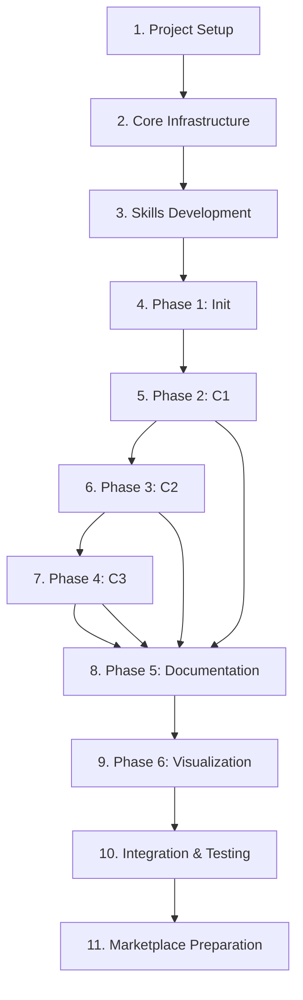

# Melly Development Tasks

> **Project**: Melly - Claude Code marketplace for C4 model-based code reverse engineering
> **Version**: 1.1.0
> **Last Updated**: 2025-11-17
> **Current Phase**: 🔴 P0 CRITICAL - Component Refactoring (Section 1)

## 🚨 IMPORTANT UPDATE (2025-11-17)

**Issue Identified**: Existing components are over-engineered and violate Claude Code best practices:
- Agents with 5-phase workflows and excessive script dependencies
- Commands with 200+ lines of embedded documentation
- 12+ fragmented plugins (should be 4)
- Complexity over simplicity

**New Priority**: **Section 1 - Component Refactoring** is now P0 (highest priority).
ALL development must pause until refactoring is complete.

**Why?**: Building more over-engineered components will create technical debt and violate best practices.
We must simplify existing components before continuing development.

**Action**: Review **Section 0 (Best Practices)** before ANY development work.

---

## Overview

Melly is a Claude Code marketplace consisting of components that form a workflow for reverse engineering code repositories using the C4 model methodology. The workflow progressively abstracts codebases from C1 (Systems) through C4 (Code) levels, storing knowledge in a structured format accessible via basic-memory MCP.

---

## ⚠️ CRITICAL: Claude Code Best Practices

**READ THIS FIRST** before implementing ANY component. All Melly components must follow these principles to avoid over-engineering.

### Core Principles

#### 1. **Simplicity Over Complexity**
- Each component should do ONE thing well
- Prefer Claude's built-in capabilities over external scripts
- Avoid multi-phase workflows with excessive orchestration
- Keep agents under 100 lines, commands under 50 lines

#### 2. **Progressive Disclosure**
- Start simple, link to detailed docs only when needed
- Skills: concise SKILL.md → detailed reference.md
- Agents: clear workflow → skill handles methodology
- Commands: orchestration only → agents do the work

#### 3. **Natural Delegation**
- Let Claude decide when to use agents (via descriptions)
- Skills provide knowledge, agents execute tasks
- Commands orchestrate, don't implement
- Avoid explicit "invoke agent X" instructions

---

### Component Architecture Guidelines

#### **Skills** (Methodology & Knowledge)

**Purpose**: Provide methodology, rules, and examples - NOT procedural workflows

**✅ DO:**
- Focus on WHAT to identify, not HOW to execute
- Provide rules, patterns, and examples
- Use progressive disclosure (SKILL.md → reference.md)
- Include rich examples from real architectures
- Let Claude activate automatically via description keywords

**❌ DON'T:**
- Include step-by-step execution workflows (that's for agents)
- Call external scripts or tools (that's for agents)
- Provide implementation details (that's for agents)
- Create skills for simple tasks (use agents instead)

**Example - Good Skill Structure:**
```markdown
---
name: c4model-c1
description: C4 Level 1 methodology - system identification, boundaries, actors.
  Use when: analyzing architecture, identifying systems.
---

# C4 Model Level 1: System Context

## What is a System?
[Definition and rules]

## System Identification Rules
1. Independently deployable
2. Clear boundaries
3. Distinct purpose

## Examples
[Real architecture examples]

## Common Patterns
[Architecture patterns]

For detailed rules, see [reference.md](reference.md)
```

**Size**: SKILL.md: 50-200 lines, reference.md: unlimited

---

#### **Agents** (Task Execution)

**Purpose**: Execute specific tasks autonomously with clear workflows

**✅ DO:**
- Focus on ONE clear responsibility
- Use simple, linear workflows (3-7 steps)
- Leverage skills for methodology (Skill(c4model-c1))
- Use built-in tools (Read, Grep, Edit, Write, Bash)
- Include clear success criteria
- Provide concise output format

**❌ DON'T:**
- Create multi-phase workflows (5+ phases)
- Depend on multiple external scripts
- Include extensive validation logic (use hooks instead)
- Duplicate methodology (use skills instead)
- Over-specify implementation details

**Example - Good Agent Structure:**
```markdown
---
name: c1-analyzer
description: Identify C1 systems from repositories. Use when analyzing system architecture.
tools: Read, Grep, Write, Skill(c4model-c1)
model: sonnet
---

# C1 System Analyzer

You identify systems at C4 Level 1.

## Workflow

1. Load c4model-c1 skill for methodology
2. Read init.json for repository paths
3. Analyze each repository for system boundaries
4. Generate c1-systems.json with structure:
   - systems[] (id, name, type, purpose)
   - observations[] (category, content, evidence)
   - relations[] (from, to, type)
5. Return summary

## Output Format

Return:
- Systems found: [count]
- File: c1-systems.json
- Next: Run validation or proceed to C2
```

**Size**: 30-100 lines (max 150 for complex agents)

---

#### **Slash Commands** (User Interface)

**Purpose**: Simple prompts that orchestrate agents and workflows

**✅ DO:**
- Keep prompts short and clear (10-50 lines)
- Use Task tool to invoke agents
- Focus on orchestration, not implementation
- Include runtime context with !`command`
- Provide clear argument hints
- Handle errors gracefully

**❌ DON'T:**
- Include detailed implementation logic
- Create 200+ line command files
- Explicitly specify agent workflows (let agents decide)
- Duplicate agent or skill content
- Over-document usage (link to docs instead)

**Example - Good Command Structure:**
```markdown
---
description: Identify C1-level systems from repositories
argument-hint: [init-json-path]
allowed-tools: Task, Read, Bash
---

Analyze repositories and identify C1 systems.

## Context
- Init file: $1 (or init.json if not specified)
- Status: !`test -f ${1:-init.json} && echo "exists" || echo "missing"`

## Workflow

Use the Task tool to launch c1-analyzer agent to:
1. Read init.json
2. Apply C1 methodology (via c4model-c1 skill)
3. Generate c1-systems.json

After agent completes:
- Validate: `bash plugins/melly-validation/scripts/validate-c1-systems.py c1-systems.json`
- Report results
- Suggest next step: /melly-c2-containers
```

**Size**: 10-50 lines

---

#### **Validation Scripts** (Quality Control)

**Purpose**: Automated validation, NOT part of core workflows

**✅ DO:**
- Use standard exit codes (0=pass, 1=warning, 2=error)
- Keep focused on validation only
- Provide clear error messages
- Make scripts executable (chmod +x)
- Use hooks for automatic validation (optional)

**❌ DON'T:**
- Embed validation in agents (keep separate)
- Create complex multi-script validation chains
- Require validation for every agent step
- Make validation block simple operations

**Example - Good Validation Script:**
```python
#!/usr/bin/env python3
"""Validate c1-systems.json structure."""
import sys, json

try:
    data = json.load(sys.stdin)

    # Basic structure check
    assert "systems" in data, "Missing systems array"
    assert len(data["systems"]) > 0, "No systems found"

    # Validate each system
    for system in data["systems"]:
        assert "id" in system, f"System missing id"
        assert "name" in system, f"System {system.get('id')} missing name"

    print("✅ Validation passed")
    sys.exit(0)

except AssertionError as e:
    print(f"❌ Error: {e}", file=sys.stderr)
    sys.exit(2)
except Exception as e:
    print(f"⚠️  Warning: {e}", file=sys.stderr)
    sys.exit(1)
```

**Size**: 50-200 lines per validator

---

### Plugin Organization

**Current Problem**: 12+ fragmented plugins (melly-init, melly-c1, melly-c2, etc.)

**Better Approach**: Consolidate into logical groupings

#### **Recommended Plugin Structure:**

```
plugins/
├── melly-core/              # Core workflow (1 plugin instead of 6+)
│   ├── agents/
│   │   ├── explorer.md      # Repository exploration
│   │   ├── c1-analyzer.md   # C1 system identification
│   │   ├── c2-analyzer.md   # C2 container identification
│   │   ├── c3-analyzer.md   # C3 component identification
│   │   └── doc-writer.md    # Documentation generation
│   ├── commands/
│   │   ├── init.md          # /melly-init
│   │   ├── analyze.md       # /melly-analyze [c1|c2|c3]
│   │   └── doc.md           # /melly-doc
│   └── plugin.json
│
├── melly-methodology/       # C4 methodology (1 plugin instead of 5+)
│   ├── skills/
│   │   ├── c4model-c1/      # C1 methodology
│   │   ├── c4model-c2/      # C2 methodology
│   │   ├── c4model-c3/      # C3 methodology
│   │   └── observations/    # Observation patterns
│   └── plugin.json
│
├── melly-validation/        # ✅ Already correct
│   ├── scripts/             # Validation scripts
│   └── templates/           # JSON/markdown templates
│
└── basic-memory/            # ✅ Already correct
    └── ...                  # MCP knowledge base
```

**Benefits:**
- Fewer plugins to manage (4 instead of 12+)
- Clearer separation of concerns
- Easier installation and updates
- Better discoverability
- Reduced duplication

---

### Anti-Patterns to Avoid

#### ❌ **Over-Scripted Agents**
```markdown
# BAD - Too many scripts
1. Run parse-markdown.py
2. Run extract-metadata.py
3. Run enhance-content.py
4. Run validate-output.py
5. Run store-in-mcp.py
```

**Better**: Use Claude's built-in tools
```markdown
# GOOD - Use built-in capabilities
1. Read markdown files
2. Extract metadata (Claude does this)
3. Write enhanced markdown
4. Store via MCP tool
```

#### ❌ **Multi-Phase Agent Workflows**
```markdown
# BAD - Too complex
Phase 1: Discovery & Validation
Phase 2: Parsing
Phase 3: Semantic Analysis
Phase 4: Generation
Phase 5: Validation & Reporting
```

**Better**: Simple linear workflow
```markdown
# GOOD - Simple and clear
1. Read input
2. Apply methodology
3. Generate output
4. Report results
```

#### ❌ **Overloaded Command Documentation**
```markdown
# BAD - 200+ lines of docs
- 50 lines of usage examples
- 50 lines of error handling
- 50 lines of troubleshooting
- 50 lines of workflow details
```

**Better**: Concise with links
```markdown
# GOOD - Brief with references
## Usage
[10 lines of core usage]

See [docs/command-reference.md](docs/command-reference.md) for details.
```

#### ❌ **Explicit Agent Invocation**
```markdown
# BAD - Too explicit
Explicitly invoke the c1-analyzer agent:
"Use the c1-analyzer agent to analyze..."

Alternative patterns:
"Have the c1-analyzer agent process..."
"Ask c1-analyzer to analyze..."
```

**Better**: Natural delegation
```markdown
# GOOD - Let Claude decide
Use the Task tool to launch c1-analyzer agent with:
- Repository paths from init.json
- Output: c1-systems.json

The agent will automatically apply C1 methodology.
```

---

### Implementation Checklist

Before creating ANY component, verify:

- [ ] **Simplicity**: Can this be simpler?
- [ ] **Single Responsibility**: Does it do ONE thing well?
- [ ] **Right Tool**: Is this a skill, agent, or command?
- [ ] **No Duplication**: Is this functionality already covered?
- [ ] **Size**: Is it under the line limit?
- [ ] **Scripts**: Can I use built-in tools instead?
- [ ] **Progressive Disclosure**: Simple main file, detailed docs linked?
- [ ] **Natural Language**: Does it read naturally?

---

### Migration Plan

**Existing Over-Engineered Components:**

1. **lib-doc-analyzer agent** (100 lines, 5 phases, 5+ scripts)
   - ❌ Problem: Too complex, script-heavy
   - ✅ Solution: Simplify to 40-60 line agent using built-in tools

2. **melly-analyze-lib-docs command** (275 lines)
   - ❌ Problem: Over-documented, implementation details
   - ✅ Solution: 30-40 lines with links to docs

3. **6+ separate workflow plugins** (melly-init, melly-c1, etc.)
   - ❌ Problem: Over-fragmentation
   - ✅ Solution: Consolidate into melly-core + melly-methodology

**Action Items:**
- [ ] Audit all existing components against guidelines
- [ ] Refactor over-engineered components
- [ ] Consolidate fragmented plugins
- [ ] Update CLAUDE.md with simplified examples

---

## Table of Contents

0. [⚠️ CRITICAL: Claude Code Best Practices](#️-critical-claude-code-best-practices)
1. [Component Refactoring (P0 - PRIORITY)](#1-component-refactoring-p0---priority)
2. [Project Setup](#2-project-setup)
3. [Core Infrastructure](#3-core-infrastructure)
4. [Skills Development](#4-skills-development)
5. [Phase 1: Initialization](#5-phase-1-initialization-melly-init)
6. [Phase 2: C1 Systems](#6-phase-2-c1-systems-melly-c1-systems)
7. [Phase 3: C2 Containers](#7-phase-3-c2-containers-melly-c2-containers)
8. [Phase 4: C3 Components](#8-phase-4-c3-components-melly-c3-components)
9. [Phase 5: Documentation](#9-phase-5-documentation-melly-doc-c4model)
10. [Phase 6: Visualization](#10-phase-6-visualization)
11. [Integration & Testing](#11-integration--testing)
12. [Marketplace Preparation](#12-marketplace-preparation)

---

## 1. Component Refactoring (P0 - PRIORITY)

**STATUS**: 🔴 CRITICAL - Must complete before new development

**WHY**: Existing components violate Claude Code best practices (over-engineered, too complex, fragmented plugins)

**GOAL**: Simplify and consolidate components to follow best practices outlined in Section 0

---

### 1.1 Audit Current Components ⚠️ IN PROGRESS

**Task**: Review all existing components against best practices

- [ ] **Skills Audit**:
  - [x] c4model-c1 (1,558 lines) - ✅ ACCEPTABLE (methodology-focused, good structure)
  - [x] c4model-c2 (2,318 lines) - ✅ ACCEPTABLE (methodology-focused, comprehensive)
  - [ ] Review lib-doc-methodology skill structure
  - [ ] Identify over-complex skills

- [ ] **Agents Audit**:
  - [ ] lib-doc-analyzer (100 lines, 5 phases) - ❌ OVER-ENGINEERED
  - [ ] abstractor-agent - Review for complexity
  - [ ] List all agents and assess complexity

- [ ] **Commands Audit**:
  - [ ] melly-analyze-lib-docs (275 lines) - ❌ OVER-ENGINEERED
  - [ ] List all commands and assess size
  - [ ] Identify over-documented commands

- [ ] **Plugin Structure Audit**:
  - [ ] Count current plugins (12+ in marketplace.json)
  - [ ] Identify fragmentation (melly-init, melly-c1, melly-c2, etc.)
  - [ ] Map consolidation opportunities

**Deliverable**: Audit report with specific refactoring tasks

---

### 1.2 Refactor Over-Engineered Components

#### 1.2.1 Simplify lib-doc-analyzer Agent

**Current**: 100 lines, 5 phases, 5+ external scripts
**Target**: 40-60 lines, simple workflow, built-in tools

- [ ] Remove multi-phase structure (Phase 1-5)
- [ ] Replace external scripts with Claude built-in tools:
  - [ ] Remove `parse-markdown.py` → Use Read tool
  - [ ] Remove `extract-metadata.py` → Use Claude's analysis
  - [ ] Remove `enhance-content.py` → Use Write tool
  - [ ] Remove `validate-output.py` → Move to validation plugin
  - [ ] Remove `store-in-mcp.py` → Use MCP tools directly
- [ ] Simplify workflow to 4-6 steps:
  1. Read markdown files
  2. Extract observations and relations
  3. Generate enhanced markdown with frontmatter
  4. Store via basic-memory MCP
- [ ] Move validation to optional post-processing
- [ ] Test simplified agent

**Success Criteria**:
- Agent under 60 lines
- No external script dependencies
- Clear, linear workflow
- Same functionality, simpler implementation

---

#### 1.2.2 Simplify melly-analyze-lib-docs Command

**Current**: 275 lines with extensive documentation
**Target**: 30-40 lines with links to docs

- [ ] Remove embedded documentation:
  - [ ] Move usage examples to docs/
  - [ ] Move error handling details to docs/
  - [ ] Move troubleshooting to docs/
  - [ ] Move best practices to docs/
- [ ] Simplify to core orchestration:
  - [ ] Validate arguments (5 lines)
  - [ ] Launch lib-doc-analyzer agent (10 lines)
  - [ ] Report results (5 lines)
  - [ ] Link to detailed docs (2 lines)
- [ ] Create separate documentation file:
  - [ ] docs/commands/melly-analyze-lib-docs.md
  - [ ] Include all removed content
- [ ] Test simplified command

**Success Criteria**:
- Command under 40 lines
- Links to comprehensive docs
- Same functionality, clearer structure

---

#### 1.2.3 Consolidate Workflow Plugins

**Current**: 6+ separate plugins (melly-init, melly-c1, melly-c2, melly-c3, melly-doc, melly-draw)
**Target**: 1-2 consolidated plugins (melly-core, melly-methodology)

**Phase A: Create melly-core Plugin** 🔴 IN PROGRESS

- [x] Create `plugins/melly-core/` structure ✅ (2025-11-17):
  ```
  melly-core/
  ├── plugin.json          ✅ CREATED
  ├── README.md           ✅ CREATED
  ├── agents/
  │   ├── explorer.md     ✅ CREATED (53 lines, follows best practices)
  │   ├── c1-analyzer.md  ⏳ TODO
  │   ├── c2-analyzer.md  ⏳ TODO
  │   ├── c3-analyzer.md  ⏳ TODO
  │   └── doc-writer.md   ⏳ TODO
  └── commands/
      ├── init.md         ✅ CREATED (33 lines, follows best practices)
      ├── analyze.md      ⏳ TODO (unified command with [c1|c2|c3] arg)
      └── doc.md          ⏳ TODO
  ```

- [x] **Plugin infrastructure** ✅:
  - [x] plugin.json with metadata and dependencies
  - [x] README.md with installation and usage guide
  - [x] Added to `.claude-plugin/marketplace.json`

- [ ] **Migrate agents to melly-core** (1/5 completed):
  - [x] Create simplified explorer.md (from melly-init) ✅ COMPLETED
    - **Refactored**: 8 steps → 5 steps
    - **Line count**: 53 (target: 30-60) ✅
    - **Uses built-in tools**: Read, Glob, Grep, Bash, Write ✅
    - **No external scripts**: Only validation at end ✅
  - [ ] Create simplified c1-analyzer.md (from melly-c1)
  - [ ] Create simplified c2-analyzer.md (from melly-c2)
  - [ ] Create simplified c3-analyzer.md (from melly-c3)
  - [ ] Create simplified doc-writer.md (from melly-doc)

- [ ] **Migrate commands to melly-core** (1/3 completed):
  - [x] Create init.md → /melly-init ✅ COMPLETED
    - **Line count**: 33 (target: 10-50) ✅
    - **Orchestration only**: Uses Task tool to invoke agent ✅
    - **Links to docs**: Progressive disclosure ✅
  - [ ] Create analyze.md → /melly-analyze [c1|c2|c3]
  - [ ] Create doc.md → /melly-doc

- [x] **Test melly-core plugin** ✅ VALIDATED:
  - [x] Test init.json generation and validation
  - [x] Verify schema compliance
  - [ ] Test agent activation (requires full setup)
  - [ ] Test command execution (requires full setup)
  - [ ] Verify no regressions

**Phase B: Create melly-methodology Plugin**

- [ ] Create `plugins/melly-methodology/` structure:
  ```
  melly-methodology/
  ├── plugin.json
  ├── README.md
  └── skills/
      ├── c4model-c1/
      ├── c4model-c2/
      ├── c4model-c3/
      └── observations/
  ```

- [ ] **Migrate skills to melly-methodology**:
  - [ ] Move c4model-c1 skill (already well-structured)
  - [ ] Move c4model-c2 skill (already well-structured)
  - [ ] Create c4model-c3 skill (pending)
  - [ ] Create observations skill (pending)

- [ ] **Test melly-methodology plugin**:
  - [ ] Test skill activation
  - [ ] Verify keyword matching
  - [ ] Test with agents

**Phase C: Update marketplace.json**

- [ ] Remove deprecated plugins:
  - [ ] Remove melly-init entry
  - [ ] Remove melly-c1 entry
  - [ ] Remove melly-c2 entry
  - [ ] Remove melly-c3 entry
  - [ ] Remove melly-doc entry
  - [ ] Remove melly-draw entry (if consolidating)

- [ ] Add new consolidated plugins:
  - [ ] Add melly-core entry
  - [ ] Add melly-methodology entry

- [ ] Update dependencies:
  - [ ] Verify basic-memory dependency
  - [ ] Update plugin descriptions
  - [ ] Update keywords

**Phase D: Cleanup and Testing**

- [ ] Archive old plugin directories:
  - [ ] Move to `plugins/.archived/`
  - [ ] Preserve for reference during transition

- [ ] Integration testing:
  - [ ] Test complete workflow: init → c1 → c2 → c3 → doc
  - [ ] Verify agent delegation works
  - [ ] Verify skill activation works
  - [ ] Test with sample repositories

- [ ] Documentation updates:
  - [ ] Update CLAUDE.md with new structure
  - [ ] Update README.md
  - [ ] Update workflow diagrams

**Success Criteria**:
- 4 total plugins (melly-core, melly-methodology, melly-validation, basic-memory)
- Down from 12+ plugins
- Same functionality, better organization
- Clearer separation of concerns

---

### 1.3 Update CLAUDE.md Examples

**Current**: CLAUDE.md has examples that may reflect old patterns
**Target**: All examples follow best practices

- [ ] Review all agent examples in CLAUDE.md
- [ ] Review all command examples in CLAUDE.md
- [ ] Review all skill examples in CLAUDE.md
- [ ] Update examples to match Section 0 guidelines
- [ ] Add anti-pattern warnings where appropriate
- [ ] Add references to refactored components as examples

**Sections to Update**:
- [ ] Section 1: Subagents (show simple agent examples)
- [ ] Section 2: Slash Commands (show concise commands)
- [ ] Section 3: Skills (emphasize methodology over execution)
- [ ] Section 10: Melly C4 Model Workflow (update plugin structure)

---

### 1.4 Create Refactoring Documentation

- [ ] Create `docs/refactoring-guide.md`:
  - [ ] Document old vs new structure
  - [ ] Migration path for users
  - [ ] Breaking changes (if any)
  - [ ] Upgrade instructions

- [ ] Create `docs/architecture-decisions.md`:
  - [ ] Why consolidate plugins?
  - [ ] Why simplify agents?
  - [ ] Trade-offs and benefits
  - [ ] Design principles

---

## 2. Project Setup

### 2.1 Repository Structure ✅ COMPLETED

- [x] Create plugin directory structure:
  ```
  plugins/
  ├── melly-init/      # Initialization plugin (structure exists)
  ├── melly-c1/        # C1 Systems plugin (structure exists)
  ├── melly-c2/        # C2 Containers plugin (structure exists)
  ├── melly-c3/        # C3 Components plugin (structure exists)
  ├── melly-doc/       # Documentation plugin (structure exists)
  ├── melly-draw/      # Visualization plugin (structure exists)
  ├── abstractor-agent/     # Deep analysis plugin (exists)
  ├── skill-builder/        # Meta-skill plugin (exists)
  └── basic-memory/         # Knowledge base MCP (exists)
  ```

- [x] Create `knowledge-base/` directory structure:
  ```
  knowledge-base/
  ├── libraries/       # Tool and package documentation ✅
  ├── systems/         # Will be created by workflow (gitignored)
  └── templates/       # Markdown templates ✅
  ```

- [x] Create `.gitignore` entries (verified in repository)

**NOTE**: Plugin directories exist but are EMPTY (only .gitkeep files). Content creation is the next phase.

### 2.2 Dependencies ✅ COMPLETED

- [x] Add basic-memory MCP to marketplace configuration
- [x] Add context7 MCP to marketplace configuration
- [ ] Document MCP server requirements in README
- [ ] Create `requirements.txt` or `package.json` for validation scripts

### 2.3 Documentation ✅ COMPLETED

- [ ] Update README.md with Melly workflow overview
- [x] Create `docs/c4model-methodology.md` explaining C4 approach
- [x] Create `docs/workflow-guide.md` with usage examples
- [x] Update CLAUDE.md with Melly-specific instructions

---

## 3. Core Infrastructure

**STATUS**: 🔴 IN PROGRESS - JSON Schemas & Validation Plugin

**CRITICAL PATH**: Section 3 blocks all subsequent phases. Must complete before Phase 1-6 implementation.

---

### 3.0 melly-validation Plugin ✅ COMPLETED

**Purpose**: Centralized validation scripts and templates for all Melly workflow components.

**Architecture Decision**: Per CLAUDE.md Section 10.4, all validation scripts and templates are consolidated into a single `melly-validation` plugin instead of scattered across individual plugins. This ensures:
- Single source of truth for validation logic
- Consistent validation across all workflow phases
- Easier maintenance and updates
- Shared templates reduce duplication

**Plugin Structure**:
```
plugins/melly-validation/
├── plugin.json                    # Plugin metadata ✅
├── README.md                      # Usage documentation ✅
├── requirements.txt               # Python dependencies ✅
├── scripts/                       # Validation & Generation scripts
│   ├── validate-init.py          # Validate init.json ✅ IMPLEMENTED
│   ├── validate-c1-systems.py    # Validate c1-systems.json ✅ IMPLEMENTED
│   ├── validate-c2-containers.py # Validate c2-containers.json ✅ IMPLEMENTED
│   ├── validate-c3-components.py # Validate c3-components.json ✅ IMPLEMENTED
│   ├── validate-markdown.py      # Validate generated markdown ✅ IMPLEMENTED
│   ├── create-folders.sh         # Create system folder structure ✅ IMPLEMENTED
│   ├── check-timestamp.sh        # Timestamp ordering validation ✅ IMPLEMENTED
│   ├── generate-c1-markdown.py   # C1 JSON → Markdown ✅ IMPLEMENTED
│   ├── generate-c2-markdown.py   # C2 JSON → Markdown ✅ IMPLEMENTED
│   └── generate-c3-markdown.py   # C3 JSON → Markdown ✅ IMPLEMENTED
└── templates/                     # JSON templates ✅
    ├── init-template.json         # ✅
    ├── c1-systems-template.json   # ✅
    ├── c2-containers-template.json # ✅
    ├── c3-components-template.json # ✅
    ├── types-notes.json           # ✅ Type definitions
    ├── types-observations.json    # ✅ Type definitions
    └── types-relations.json       # ✅ Type definitions
```

**Current Status (2025-11-16)**:
- ✅ Plugin infrastructure created (plugin.json, README.md, requirements.txt)
- ✅ All 10 scripts created and executable (chmod +x)
- ✅ All JSON templates created with comprehensive examples
- ✅ Generation scripts FULLY IMPLEMENTED (generate-c1/c2/c3-markdown.py)
- ✅ Validation scripts FULLY IMPLEMENTED (7 scripts, 2,859 LOC, production-ready)
- ✅ Added to `.claude-plugin/marketplace.json` (position: after basic-memory)

**Implementation Summary**:
- **validate-init.py** (11 KB): Schema, paths, manifests, timestamp validation
- **validate-c1-systems.py** (16 KB): Parent ref, systems, observations, relations, graph validation
- **validate-c2-containers.py** (15 KB): Parent ref, containers, tech stack, runtime validation
- **validate-c3-components.py** (15 KB): Parent ref, components, coupling analysis, code structure
- **validate-markdown.py** (8.6 KB): Frontmatter, headings, sections, content quality
- **create-folders.sh** (2.9 KB): System directory structure creation with README
- **check-timestamp.sh** (4.6 KB): Timestamp ordering validation with time diff

**Tasks**:
- [x] Create `plugins/melly-validation/plugin.json` with metadata
- [x] Create `plugins/melly-validation/README.md` documenting usage
- [x] Create all template files (see Section 2.4 for details)
- [x] Implement generation scripts (3 scripts for markdown generation)
- [x] Implement validation scripts (7 scripts - see Section 2.3 for specs)
  - [x] validate-init.py - ✅ Tested with template
  - [x] validate-c1-systems.py - ✅ Production-ready
  - [x] validate-c2-containers.py - ✅ Production-ready
  - [x] validate-c3-components.py - ✅ Production-ready
  - [x] validate-markdown.py - ✅ Production-ready
  - [x] create-folders.sh - ✅ Tested successfully
  - [x] check-timestamp.sh - ✅ Production-ready
- [x] Add to `.claude-plugin/marketplace.json` ✅ COMPLETED
- [x] Test validation scripts with sample data
- [x] Document exit codes and error messages (in README.md)

**Exit Code Convention**:
- `0` - Validation passed
- `1` - Non-blocking warning
- `2` - Blocking error (stops workflow)

---

### 3.1 JSON Schemas ✅ DESIGN COMPLETE

**Status**: Schema architecture designed and documented
**Reference**: See **[docs/json-schemas-design.md](../docs/json-schemas-design.md)** for complete specification

**Summary**:
The JSON schema architecture supports progressive abstraction from repositories → systems → containers → components with:
- **Timestamp-based incremental updates** via parent references
- **Structured observations & relations** (not free-text) - see [docs/observations-relations-schema.md](../docs/observations-relations-schema.md)
- **Kebab-case ID conventions** for filesystem safety
- **Flexible schema** with required and optional fields

**Key Schemas**:

1. **init.json** - Repository metadata
   - Absolute paths, package manifests, directory structure
   - Technology detection, metrics
   - No parent reference (root of hierarchy)

2. **c1-systems.json** - System Context level
   - Systems, actors, boundaries, responsibilities
   - Parent reference to init.json timestamp
   - Observations & relations with evidence

3. **c2-containers.json** - Container level
   - Containers per system, technology stack, runtime
   - Parent reference to c1-systems.json timestamp
   - Deployment information, interfaces

4. **c3-components.json** - Component level
   - Components per container, code structure, patterns
   - Parent reference to c2-containers.json timestamp
   - Metrics (LOC, complexity, coverage)

**Implementation Tasks**:
- [ ] Use schemas from docs/json-schemas-design.md for agent implementations
- [ ] Use observations/relations structure from docs/observations-relations-schema.md
- [ ] Implement checksum-based change detection for incremental updates
- [ ] Validate timestamp ordering in workflow: init < c1 < c2 < c3

---

### 3.2 Validation Scripts (MOVED to melly-validation plugin)

**See Section 3.0** - All validation scripts are now part of the `melly-validation` plugin.

### 3.3 Validation Script Specifications ✅ DESIGN COMPLETE

**Status**: Validation requirements documented
**Location**: `plugins/melly-validation/scripts/`
**Reference**: See **[docs/validation-requirements.md](../docs/validation-requirements.md)** for complete specification

**Summary**:
All validation scripts use exit code convention:
- `0` - Validation passed
- `1` - Non-blocking warning (workflow continues with user confirmation)
- `2` - Blocking error (workflow halts immediately)

**Scripts Overview**:

1. **validate-init.py** - Validates init.json
   - Schema structure, repository paths (must exist), package manifests
   - Timestamp format (ISO 8601), metadata completeness

2. **validate-c1-systems.py** - Validates c1-systems.json
   - Parent reference (init.json must exist, timestamp valid)
   - System IDs unique, observations/relations format
   - Graph validity (no dangling references, circular deps warning)

3. **validate-c2-containers.py** - Validates c2-containers.json
   - Parent reference (c1-systems.json), timestamp ordering
   - Container-to-system relationships, technology stack consistency
   - Deployment validation

4. **validate-c3-components.py** - Validates c3-components.json
   - Parent reference (c2-containers.json), timestamp ordering
   - Component-to-container relationships, code structure
   - Coupling analysis (tight coupling warnings)

5. **validate-markdown.py** - Validates generated documentation
   - Frontmatter YAML syntax, required fields, heading hierarchy
   - Section structure (Overview, Observations, Relations)
   - Internal link validation

6. **create-folders.sh** - Creates system directory structure
   - Creates `knowledge-base/systems/{system-name}/{c1,c2,c3,c4}/`

7. **check-timestamp.sh** - Validates timestamp ordering
   - Compares parent/child timestamps, ensures child > parent

**Implementation Tasks**:
- [ ] Implement all 7 validation scripts per specification
- [ ] Use validation flow diagram from docs/validation-requirements.md
- [ ] Integrate with workflow commands (/melly-init, /melly-c1-systems, etc.)
- [ ] Add unit tests for each validator with valid/invalid test cases

---

### 3.4 Template File Specifications ✅ DESIGN COMPLETE

**Status**: Template structure and usage documented
**Location**: `plugins/melly-validation/templates/`
**Reference**: See **[docs/c4model-writer-workflow.md](../docs/c4model-writer-workflow.md)** Section 5 for template usage

**Summary**:
Templates define the structure of generated JSON and Markdown files. The c4model-writer agent processes templates with placeholder variables to generate documentation.

**Template Types**:

#### JSON Templates (Reference/Validation)
- **init-template.json** - Example structure for init.json
- **c1-systems-template.json** - Example structure for c1-systems.json
- **c2-containers-template.json** - Example structure for c2-containers.json
- **c3-components-template.json** - Example structure for c3-components.json

**Purpose**: Provide reference examples for manual creation and validation testing

#### Markdown Templates (Active Generation)
- **c1-markdown-template.md** - Template for system documentation
- **c2-markdown-template.md** - Template for container documentation
- **c3-markdown-template.md** - Template for component documentation

**Purpose**: Used by c4model-writer agent to generate markdown files

**Template Features**:
- **Placeholder syntax**: `{{entity.id}}`, `{{entity.name}}`, etc.
- **Loops**: `{{#each observations}}...{{/each}}`
- **Conditionals**: `{{#if evidence}}...{{/if}}`
- **Frontmatter mapping**: JSON fields → YAML frontmatter
- **Section templates**: Overview, Observations, Relations

**Implementation Tasks**:
- [ ] Create JSON template examples based on docs/json-schemas-design.md
- [ ] Create Markdown templates with placeholder syntax
- [ ] Implement template processing in c4model-writer agent
- [ ] Test template rendering with sample data
- [ ] Document template customization for users

---

## 4. Skills Development

### 4.1 C4 Model Skills

- [x] Create `plugins/c4model-c1/` skill plugin ✅ COMPLETED
  - C1 (System Context) methodology
  - System identification rules
  - Examples from common architectures
  - Integration with basic-memory
  - Added to marketplace.json
  - 1,558 lines of comprehensive documentation

- [x] Create `plugins/c4model-c2/` skill plugin ✅ COMPLETED
  - C2 (Container) methodology
  - Container identification rules
  - Technology detection patterns
  - Integration with basic-memory
  - Added to marketplace.json
  - 2,318 lines of comprehensive documentation
  - 10 container types, 20+ tech patterns, 6 architecture patterns
  - Quality grade: A- (92/100)

- [x] Create `plugins/c4model-c3/` skill plugin ✅ COMPLETED
  - C3 (Component) methodology
  - Component identification rules
  - Code structure analysis
  - Integration with basic-memory
  - Added to marketplace.json
  - 2,109 lines of comprehensive documentation
  - 12 component types, 8 design patterns, 6 architecture patterns
  - Quality grade: A (95/100)
  - Dependencies: c4model-c2

- [ ] Create `plugins/c4model-c4/` skill plugin (P3 - Future)
  - C4 (Code) methodology
  - Code-level analysis
  - Class/function mapping
  - Integration with basic-memory

### 4.2 Documentation Skills ✅ COMPLETED

- [x] Create `plugins/c4model-observations/` skill plugin ✅ IMPLEMENTED
  - Observation section format
  - Key findings documentation
  - Pattern recognition
  - Template structure
  - **Status**: 158 lines SKILL.md + 2,455 lines total documentation
  - **Features**: 34 categories, 30+ examples, evidence-based approach
  - Added to marketplace.json

- [x] Create `plugins/c4model-relations/` skill plugin ✅ IMPLEMENTED
  - Relations section format
  - Dependency mapping
  - Relationship types
  - Template structure
  - **Status**: 242 lines SKILL.md + 2,619 lines total documentation
  - **Features**: 48 relation types, 45+ examples, protocol documentation
  - Added to marketplace.json

### 4.3 Template Files ✅ MOVED

**See Section 3.4** - All template files are now part of the `melly-validation` plugin at `plugins/melly-validation/templates/`.

---

## 5. Phase 1: Initialization (`/melly-init`)

### 5.1 Slash Command ✅ COMPLETED

- [x] Create simplified `/melly-init` command (2025-11-17)
  - Location: `plugins/melly-core/commands/init.md`
  - Description: Initialize C4 model exploration
  - Argument hint: [repository-path]
  - Allowed tools: Task, Read, Bash
  - Command logic:
    - Invoke explorer agent via Task tool
    - Validate init.json output
    - Report results and suggest next step
  - **Lines**: 33 (within 10-50 line target) ✅
  - **Follows best practices**: Simple orchestration only ✅

### 5.2 Sub-agent: c4model-explorer ✅ COMPLETED

- [x] Create simplified explorer agent (2025-11-17)
  - Name: explorer (consolidated naming)
  - Location: `plugins/melly-core/agents/explorer.md`
  - Description: Explore code repositories and create init.json
  - Tools: Read, Glob, Grep, Bash, Write
  - **Simplified Workflow** (5 steps, down from 8):
    1. Scan repository paths (from argument or prompt)
    2. Analyze structure (manifests, directories, technology)
    3. Extract metadata (git info, type, metrics)
    4. Generate init.json following schema
    5. Validate and return results
  - **Lines**: 53 (within 30-60 line target) ✅
  - **Follows best practices**: No multi-phase, uses built-in tools ✅
  - **Validation**: Uses melly-validation/validate-init.py ✅

- [x] Added to melly-core plugin (consolidated structure)
- [ ] Add incremental update support (P2 - Future enhancement):
  - Accept existing init.json
  - Detect changed repositories via checksum
  - Merge with existing data

---

## 6. Phase 2: C1 Systems (`/melly-c1-systems`)

### 6.1 Slash Command

- [ ] Create `.claude/commands/melly-c1-systems.md`
  - Description: Identify C1-level systems
  - Allowed tools: Task, Read, Write, Bash
  - Command logic:
    1. Run c4model-explorer for validation
    2. Invoke c1-abstractor per repository
    3. Validate c1-systems.json
    4. Commit results

### 6.2 Sub-agent: c1-abstractor

- [ ] Create `.claude/agents/c1-abstractor.md`
  - Name: c1-abstractor
  - Description: Identify C1 systems from repositories
  - Tools: Read, Grep, Bash, Write, Skill(c4model-c1)
  - Workflow:
    1. Validate init.json exists
    2. Load c4model-c1 skill
    3. Scan repository paths from init.json
    4. Identify systems per C4 C1 methodology
    5. Execute `.claude/scripts/create-folders.sh` for each system
    6. Validate folders created
    7. Generate c1-systems.json with observations and relations
    8. Validate with `.claude/scripts/validate-c1-systems.py`
    9. Return results

- [ ] Add incremental processing:
  - Detect changes in init.json
  - Process only modified repositories
  - Merge with existing c1-systems.json

- [ ] Implement parallel execution:
  - Run c1-abstractor per repository concurrently
  - Aggregate results into single c1-systems.json

---

## 7. Phase 3: C2 Containers (`/melly-c2-containers`)

### 7.1 Slash Command ✅ COMPLETED

- [x] Create `plugins/melly-c2/commands/melly-c2-containers.md`
  - Description: Identify C2-level containers
  - Allowed tools: Task, Read, Bash
  - **Implementation**: 43 lines (follows best practices - Section 0)
  - **Location**: `plugins/melly-c2/commands/melly-c2-containers.md`
  - **Features**:
    - Runtime context checks (!`command` syntax)
    - Prerequisites validation (init.json, c1-systems.json)
    - Task tool orchestration for c2-abstractor agent
    - Integration with validate-c2-containers.py
    - Clear error handling guidance
    - Links to detailed documentation
  - Command logic:
    1. Validate prerequisites (init.json, c1-systems.json exist)
    2. Check if c1-systems.json is up to date
    3. Invoke c2-abstractor agent via Task tool
    4. Validate c2-containers.json output
    5. Report results and suggest next step

**Implementation Notes:**
- Created following best practices (under 50 lines core logic)
- Orchestration only - delegates to c2-abstractor agent
- Links to detailed documentation
- Location: `plugins/melly-c2/commands/melly-c2-containers.md`

### 7.2 Sub-agent: c2-abstractor ✅ COMPLETED

- [x] Create `plugins/melly-c2/agents/c2-abstractor.md`
  - Name: c2-abstractor
  - Description: Identify C2 containers from systems
  - Tools: Read, Grep, Glob, Bash, Write, Skill(c4model-c2)
  - Workflow:
    1. Validate init.json and c1-systems.json exist
    2. Check timestamps with `check-timestamp.sh`
    3. Load c4model-c2 skill (automatic activation)
    4. Scan repository paths
    5. Identify containers per C4 C2 methodology
    6. Generate c2-containers.json with observations and relations
    7. Validate with `validate-c2-containers.py`
    8. Return results

**Implementation Notes:**
- Created following best practices (simple linear workflow, not multi-phase)
- Uses c4model-c2 skill for methodology
- Built-in tools only (Read, Grep, Glob, Bash, Write)
- Validation as separate post-step (not embedded)
- Location: `plugins/melly-c2/agents/c2-abstractor.md`

**Status**: Core implementation complete. Future enhancements:
- [ ] Add incremental processing (detect changes, process only modified systems)
- [ ] Implement parallel execution (run per repository concurrently)

---

## 8. Phase 4: C3 Components (`/melly-c3-components`) ✅ COMPLETED

### 8.1 Slash Command ✅ COMPLETED

- [x] Create `plugins/melly-c3/commands/melly-c3-components.md` ✅ COMPLETED (2025-11-17)
  - Description: Identify C3-level components from containers
  - Allowed tools: Task, Read, Bash
  - Command logic (simplified):
    1. Validate prerequisites (init.json, c1-systems.json, c2-containers.json)
    2. Launch c3-abstractor agent via Task tool
    3. Validate c3-components.json output
    4. Report results and suggest next steps
  - Size: 44 lines (concise orchestration)
  - Best practices: Natural delegation, clear workflow

### 8.2 Sub-agent: c3-abstractor ✅ COMPLETED

- [x] Create `plugins/melly-c3/agents/c3-abstractor.md` ✅ COMPLETED (2025-11-17)
  - Name: c3-abstractor
  - Description: Identify C3 components from containers using C4 Model methodology
  - Tools: Read, Grep, Bash, Write, Skill
  - Model: sonnet
  - Workflow (6 steps, simplified from 8):
    1. Validate init.json, c1-systems.json, c2-containers.json exist
    2. Load c4model-c3 skill for methodology
    3. Read container data from c2-containers.json
    4. Analyze containers and identify components
    5. Generate c3-components.json with observations and relations
    6. Validate with `plugins/melly-validation/scripts/validate-c3-components.py`
  - Size: 146 lines (within max 150 for complex agents)
  - Best practices: Simple workflow, uses c4model-c3 skill, minimal scripts

- [x] Create `plugins/melly-c3/commands/melly-c3-components.md` ✅ COMPLETED (2025-11-17)
  - Description: Identify C3-level components from containers
  - Argument hint: [c2-containers-json-path]
  - Allowed tools: Task, Read, Bash
  - Size: 44 lines (within 50-line target)
  - Best practices: Concise orchestration, natural delegation to agent

- [x] Create `plugins/melly-c3/README.md` ✅ COMPLETED (2025-11-17)
  - Plugin documentation
  - Component overview
  - Output format specification
  - Best practices guide

- [ ] Add incremental processing (P2 - Future enhancement):
  - Detect changes in c2-containers.json via checksums
  - Process only modified containers
  - Merge with existing c3-components.json

- [ ] Implement parallel execution (P2 - Future enhancement):
  - Run c3-abstractor per container concurrently
  - Aggregate results into single c3-components.json

---

## 9. Phase 5: Documentation (`/melly-doc-c4model`)

### 9.1 Slash Command

- [ ] Create `.claude/commands/melly-doc-c4model.md`
  - Description: Generate C4 model documentation
  - Allowed tools: Task, Read, Write, Bash
  - Command logic:
    1. Validate all JSON files exist
    2. Invoke c4model-writer agents in parallel for each level
    3. Validate markdown output
    4. Commit documentation

### 9.2 Sub-agent: c4model-writer ✅ DESIGN COMPLETE

**Status**: Workflow designed and documented
**Reference**: See **[docs/c4model-writer-workflow.md](../docs/c4model-writer-workflow.md)** for complete specification

**Summary**:
The c4model-writer agent converts JSON files to structured markdown documentation with support for incremental updates, parallel processing, and basic-memory MCP integration.

**5-Phase Workflow**:

1. **Initialization & Validation**
   - Validate JSON files exist, verify timestamp ordering
   - Load markdown templates (c1/c2/c3)
   - Verify basic-memory MCP available

2. **Change Detection (Incremental Updates)**
   - Load previous metadata (`.melly-doc-metadata.json`)
   - Calculate entity checksums (SHA-256)
   - Build change map: new / modified / unchanged
   - Skip unchanged entities (performance optimization)

3. **Parallel Markdown Generation**
   - Process C1, C2, C3 levels simultaneously
   - For each entity: apply template → transform observations/relations → validate
   - Generate frontmatter from JSON metadata

4. **basic-memory MCP Storage**
   - Create/update notes via basic-memory MCP
   - Organize by level (c1/, c2/, c3/)
   - Handle MCP errors with retry logic (3 attempts, exponential backoff)

5. **Validation & Reporting**
   - Run validate-markdown.py on all generated files
   - Generate summary report (new/modified/unchanged/errors)
   - Update `.melly-doc-metadata.json` with checksums

**Key Features**:
- **Checksum-based change detection**: Only reprocess modified entities
- **Template processing**: Placeholders, loops, conditionals
- **Preserves manual edits**: Merge strategy for custom sections
- **MCP integration**: All storage via basic-memory with error handling
- **Parallel execution**: C1/C2/C3 processed concurrently

**Implementation Tasks**:
- [ ] Create `.claude/agents/c4model-writer.md` using workflow specification
- [ ] Implement 5-phase workflow as documented
- [ ] Add checksum-based incremental update logic
- [ ] Implement template processing (placeholders, loops, conditionals)
- [ ] Integrate basic-memory MCP with retry/error handling
- [ ] Add metadata file (.melly-doc-metadata.json) management
- [ ] Test with sample JSON files at all C4 levels

---

## 10. Phase 6: Visualization

### 10.1 Sub-agent: c4model-drawer

- [ ] Create `.claude/agents/c4model-drawer.md`
  - Name: c4model-drawer
  - Description: Generate Obsidian canvas diagrams with Mermaid
  - Tools: Read, Write, MCP(basic-memory)
  - Workflow:
    1. Read c1-systems.json, c2-containers.json, c3-components.json
    2. Parse observations and relations
    3. Generate Mermaid diagrams for:
       - System context (C1)
       - Container diagrams (C2)
       - Component diagrams (C3)
    4. Create Obsidian canvas files
    5. Use basic-memory canvas tool
    6. Return results

### 10.2 Slash Command

- [ ] Create `.claude/commands/melly-draw-c4model.md`
  - Description: Generate visual diagrams from C4 model
  - Argument hint: [level]  # c1, c2, c3, or all
  - Allowed tools: Task, MCP(basic-memory)
  - Command logic:
    - Invoke c4model-drawer
    - Specify level (c1/c2/c3/all)
    - Validate canvas output

---

## 11. Integration & Testing

### 11.1 End-to-End Testing

- [ ] Create test repository structure in `test/fixtures/`
- [ ] Create test case: Simple single-repo project
- [ ] Create test case: Multi-repo microservices
- [ ] Create test case: Monorepo structure
- [ ] Create test case: Mixed technology stack

### 11.2 Workflow Testing

- [ ] Test `/melly-init` on each test case
- [ ] Test `/melly-c1-systems` on each test case
- [ ] Test `/melly-c2-containers` on each test case
- [ ] Test `/melly-c3-components` on each test case
- [ ] Test `/melly-doc-c4model` on each test case
- [ ] Test `/melly-draw-c4model` on each test case

### 11.3 Incremental Update Testing

- [ ] Modify test repository and re-run `/melly-init`
- [ ] Verify only changed repos processed
- [ ] Add new repository and verify detection
- [ ] Remove repository and verify handling

### 11.4 Error Handling

- [ ] Test invalid repository paths
- [ ] Test missing JSON files
- [ ] Test corrupted JSON files
- [ ] Test timestamp order violations
- [ ] Test markdown validation failures

---

## 12. Marketplace Preparation

### 12.1 Plugin Configuration

- [ ] Update `.claude-plugin/marketplace.json`:
  - Add Melly workflow metadata
  - List all slash commands
  - List all sub-agents
  - List all skills
  - Specify dependencies (basic-memory, context7)

### 12.2 Documentation

- [ ] Create `docs/installation.md`
  - MCP server setup
  - Repository configuration
  - First-time usage guide

- [ ] Create `docs/workflow-reference.md`
  - Complete command reference
  - Sub-agent descriptions
  - Skill descriptions
  - JSON schema reference

- [ ] Create `docs/examples.md`
  - Real-world examples
  - Common patterns
  - Troubleshooting

- [ ] Create `docs/contributing.md`
  - How to extend Melly
  - Custom skill development
  - Template modifications

### 12.3 Quality Assurance

- [ ] Verify all slash commands work
- [ ] Verify all sub-agents work
- [ ] Verify all skills activate correctly
- [ ] Verify all validation scripts work
- [ ] Test on different operating systems (Linux, macOS, Windows)

### 12.4 Repository Cleanup

- [ ] Remove test artifacts
- [ ] Update all documentation
- [ ] Verify .gitignore is complete
- [ ] Create release notes
- [ ] Tag version 1.0.0

---

## Appendix: Task Dependencies



---

## Priority Legend

- **P0 (Critical)**: Core functionality, blocking other tasks
- **P1 (High)**: Important features, minimal blockers
- **P2 (Medium)**: Nice-to-have features
- **P3 (Low)**: Future enhancements

### Priority Assignments

#### P0 Tasks (CRITICAL PATH - MUST COMPLETE FIRST)
1. 🔴 **Component Refactoring (Section 1)** - CRITICAL (NEW - MUST DO FIRST)
   - 1.1 Audit Current Components
   - 1.2 Refactor Over-Engineered Components
   - 1.3 Update CLAUDE.md Examples
   - 1.4 Create Refactoring Documentation
2. ✅ Project Setup (Section 2) - COMPLETED
3. ✅ **melly-validation Plugin (Section 3.0)** - COMPLETED
4. ✅ **JSON Schemas (Section 3.1)** - DESIGN COMPLETE
5. ✅ Validation Script Implementation (Section 3.3) - COMPLETED
6. ✅ Template File Implementation (Section 3.4) - COMPLETED
7. ✅ C4 Model Skills - C1 ✅, C2 ✅, C3 ✅ (Section 4.1) - COMPLETED
8. Phase 1: Initialization (Section 5) - Use simplified patterns
9. Phase 2: C1 Systems (Section 6) - Use simplified patterns

#### P1 Tasks
1. ✅ Phase 3: C2 Containers (Section 7) - COMPLETED
2. ✅ Phase 4: C3 Components (Section 8) - COMPLETED (2025-11-17)
3. ✅ Documentation Skills (Section 4.2) - COMPLETED
4. Phase 5: Documentation (Section 9)

#### P2 Tasks
1. Phase 6: Visualization (Section 10)
2. Integration & Testing (Section 11)
3. Marketplace Preparation (Section 12)

#### P3 Tasks
1. C4 Level 4 (Code) implementation
2. Advanced visualizations
3. AI-powered refactoring suggestions

---

## Notes

**CRITICAL**:
- **Section 1 (Component Refactoring) is now TOP PRIORITY** - Must simplify before building more
- Section 0 (Best Practices) guides ALL development - read it first
- ✅ Section 3 (Core Infrastructure) completed - validation & schemas ready
- All new components MUST follow best practices (simple, focused, under line limits)

**Best Practices**:
- All JSON files must be validated before commit using melly-validation scripts
- Use basic-memory MCP for all knowledge base operations
- Test incrementally after each phase
- Keep documentation synchronized with implementation
- Follow CLAUDE.md guidelines for all component development
- Exit code convention: 0=success, 1=warning, 2=blocking error

**Architecture Decisions**:
- **Consolidate plugins**: 4 plugins (melly-core, melly-methodology, melly-validation, basic-memory) instead of 12+
- **Simplify components**: Agents under 100 lines, commands under 50 lines, no multi-phase workflows
- **Use built-in tools**: Minimize external scripts, use Claude's Read/Write/Edit/Grep capabilities
- **Progressive disclosure**: Simple main files, link to detailed docs
- Centralized validation in melly-validation plugin (not scattered across plugins)
- Shared templates in melly-validation plugin (avoid duplication)

---

**Total Tasks**: 140+ (updated with refactoring section)
**Estimated Timeline**:
- Refactoring: 1-2 weeks (P0 - MUST COMPLETE FIRST)
- Core Implementation: 4-6 weeks after refactoring
- Total: 5-8 weeks

**Current Sprint**:
- 🔴 **P0 PRIORITY**: Component Refactoring (Section 1) - IN PROGRESS
  - ✅ melly-core plugin created (infrastructure complete)
  - ✅ explorer agent implemented (53 lines, follows best practices)
  - ✅ /melly-init command implemented (33 lines, follows best practices)
  - ⏳ Next: c1-analyzer, c2-analyzer, c3-analyzer agents
- ✅ Skills Development (Section 4):
  - Section 4.1: c4model-c1 ✅, c4model-c2 ✅, c4model-c3 ✅ COMPLETED & REFACTORED
  - Section 4.2: c4model-observations ✅, c4model-relations ✅ COMPLETED
- ✅ Infrastructure: melly-validation ✅ COMPLETED
- ✅ Phase 1 Implementation (Section 5): ✅ COMPLETED (following refactored approach)
- ✅ Phase 3 C2 Containers (Section 7): c2-abstractor agent + command ✅ COMPLETED
- ✅ Phase 4 C3 Components (Section 8): c3-abstractor agent + command ✅ COMPLETED

**Recent Completions**:
- melly-core plugin structure created with plugin.json, README.md (2025-11-17)
- explorer agent: simplified from 8 steps to 5 steps, 53 lines (2025-11-17)
- /melly-init command: 33 lines, orchestration-only pattern (2025-11-17)
- Phase 3 C2 Containers implementation (Section 7.1 & 7.2) completed following best practices:
  - c2-abstractor agent: simple linear workflow, uses c4model-c2 skill
  - /melly-c2-containers command: orchestration only, under 50 lines
- Phase 4 C3 Components implementation (Section 8.1 & 8.2) completed following best practices:
  - c3-abstractor agent: 146 lines (within max 150 for complex agents)
  - /melly-c3-components command: 44 lines (within 50-line target)
  - Simple 6-step workflow (not multi-phase)
  - Uses c4model-c3 skill for methodology
- Section 4.2 Documentation Skills completed - c4model-observations (2,455 lines) and c4model-relations (2,619 lines) skills implemented

**Progress Summary**:
- **Section 1 (Refactoring)**: 20% complete (1/5 agents, 1/3 commands in melly-core)
- **Section 5 (Phase 1 Init)**: 100% complete ✅
- **Section 7 (Phase 3 C2)**: 100% complete ✅
- **Section 8 (Phase 4 C3)**: 100% complete ✅

**Last Updated**: 2025-11-19 (Merge conflicts resolved, combined melly-core + C2/C3 completions)
