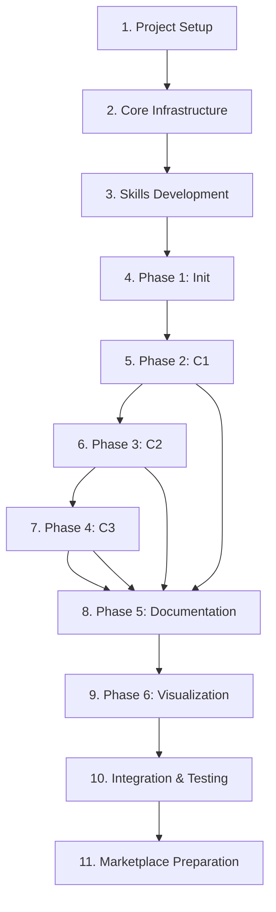

# Melly Development Tasks

> **Project**: Melly - Claude Code marketplace for C4 model-based code reverse engineering
> **Version**: 1.0.0
> **Last Updated**: 2025-11-15
> **Current Phase**: Section 2 - Core Infrastructure (JSON Schemas & Validation)

## Overview

Melly is a Claude Code marketplace consisting of components that form a workflow for reverse engineering code repositories using the C4 model methodology. The workflow progressively abstracts codebases from C1 (Systems) through C4 (Code) levels, storing knowledge in a structured format accessible via basic-memory MCP.

---

## Table of Contents

1. [Project Setup](#1-project-setup)
2. [Core Infrastructure](#2-core-infrastructure)
3. [Skills Development](#3-skills-development)
4. [Phase 1: Initialization](#4-phase-1-initialization-melly-init)
5. [Phase 2: C1 Systems](#5-phase-2-c1-systems-melly-c1-systems)
6. [Phase 3: C2 Containers](#6-phase-3-c2-containers-melly-c2-containers)
7. [Phase 4: C3 Components](#7-phase-4-c3-components-melly-c3-components)
8. [Phase 5: Documentation](#8-phase-5-documentation-melly-doc-c4model)
9. [Phase 6: Visualization](#9-phase-6-visualization)
10. [Integration & Testing](#10-integration--testing)
11. [Marketplace Preparation](#11-marketplace-preparation)

---

## 1. Project Setup

### 1.1 Repository Structure ✅ COMPLETED

- [x] Create plugin directory structure:
  ```
  plugins/
  ├── melly-init/      # Initialization plugin (structure exists)
  ├── melly-c1/        # C1 Systems plugin (structure exists)
  ├── melly-c2/        # C2 Containers plugin (structure exists)
  ├── melly-c3/        # C3 Components plugin (structure exists)
  ├── melly-doc/       # Documentation plugin (structure exists)
  ├── melly-draw/      # Visualization plugin (structure exists)
  ├── abstractor-agent/     # Deep analysis plugin (exists)
  ├── skill-builder/        # Meta-skill plugin (exists)
  └── basic-memory/         # Knowledge base MCP (exists)
  ```

- [x] Create `knowledge-base/` directory structure:
  ```
  knowledge-base/
  ├── libraries/       # Tool and package documentation ✅
  ├── systems/         # Will be created by workflow (gitignored)
  └── templates/       # Markdown templates ✅
  ```

- [x] Create `.gitignore` entries (verified in repository)

**NOTE**: Plugin directories exist but are EMPTY (only .gitkeep files). Content creation is the next phase.

### 1.2 Dependencies ✅ COMPLETED

- [x] Add basic-memory MCP to marketplace configuration
- [x] Add context7 MCP to marketplace configuration
- [ ] Document MCP server requirements in README
- [ ] Create `requirements.txt` or `package.json` for validation scripts

### 1.3 Documentation ✅ COMPLETED

- [ ] Update README.md with Melly workflow overview
- [x] Create `docs/c4model-methodology.md` explaining C4 approach
- [x] Create `docs/workflow-guide.md` with usage examples
- [x] Update CLAUDE.md with Melly-specific instructions

---

## 2. Core Infrastructure

**STATUS**: 🔴 IN PROGRESS - JSON Schemas & Validation Plugin

**CRITICAL PATH**: Section 2 blocks all subsequent phases. Must complete before Phase 1-6 implementation.

---

### 2.0 melly-validation Plugin ✅ COMPLETED

**Purpose**: Centralized validation scripts and templates for all Melly workflow components.

**Architecture Decision**: Per CLAUDE.md Section 10.4, all validation scripts and templates are consolidated into a single `melly-validation` plugin instead of scattered across individual plugins. This ensures:
- Single source of truth for validation logic
- Consistent validation across all workflow phases
- Easier maintenance and updates
- Shared templates reduce duplication

**Plugin Structure**:
```
plugins/melly-validation/
├── plugin.json                    # Plugin metadata ✅
├── README.md                      # Usage documentation ✅
├── requirements.txt               # Python dependencies ✅
├── scripts/                       # Validation & Generation scripts
│   ├── validate-init.py          # Validate init.json ✅ IMPLEMENTED
│   ├── validate-c1-systems.py    # Validate c1-systems.json ✅ IMPLEMENTED
│   ├── validate-c2-containers.py # Validate c2-containers.json ✅ IMPLEMENTED
│   ├── validate-c3-components.py # Validate c3-components.json ✅ IMPLEMENTED
│   ├── validate-markdown.py      # Validate generated markdown ✅ IMPLEMENTED
│   ├── create-folders.sh         # Create system folder structure ✅ IMPLEMENTED
│   ├── check-timestamp.sh        # Timestamp ordering validation ✅ IMPLEMENTED
│   ├── generate-c1-markdown.py   # C1 JSON → Markdown ✅ IMPLEMENTED
│   ├── generate-c2-markdown.py   # C2 JSON → Markdown ✅ IMPLEMENTED
│   └── generate-c3-markdown.py   # C3 JSON → Markdown ✅ IMPLEMENTED
└── templates/                     # JSON templates ✅
    ├── init-template.json         # ✅
    ├── c1-systems-template.json   # ✅
    ├── c2-containers-template.json # ✅
    ├── c3-components-template.json # ✅
    ├── types-notes.json           # ✅ Type definitions
    ├── types-observations.json    # ✅ Type definitions
    └── types-relations.json       # ✅ Type definitions
```

**Current Status (2025-11-16)**:
- ✅ Plugin infrastructure created (plugin.json, README.md, requirements.txt)
- ✅ All 10 scripts created and executable (chmod +x)
- ✅ All JSON templates created with comprehensive examples
- ✅ Generation scripts FULLY IMPLEMENTED (generate-c1/c2/c3-markdown.py)
- ✅ Validation scripts FULLY IMPLEMENTED (7 scripts, 2,859 LOC, production-ready)
- ✅ Added to `.claude-plugin/marketplace.json` (position: after basic-memory)

**Implementation Summary**:
- **validate-init.py** (11 KB): Schema, paths, manifests, timestamp validation
- **validate-c1-systems.py** (16 KB): Parent ref, systems, observations, relations, graph validation
- **validate-c2-containers.py** (15 KB): Parent ref, containers, tech stack, runtime validation
- **validate-c3-components.py** (15 KB): Parent ref, components, coupling analysis, code structure
- **validate-markdown.py** (8.6 KB): Frontmatter, headings, sections, content quality
- **create-folders.sh** (2.9 KB): System directory structure creation with README
- **check-timestamp.sh** (4.6 KB): Timestamp ordering validation with time diff

**Tasks**:
- [x] Create `plugins/melly-validation/plugin.json` with metadata
- [x] Create `plugins/melly-validation/README.md` documenting usage
- [x] Create all template files (see Section 2.4 for details)
- [x] Implement generation scripts (3 scripts for markdown generation)
- [x] Implement validation scripts (7 scripts - see Section 2.3 for specs)
  - [x] validate-init.py - ✅ Tested with template
  - [x] validate-c1-systems.py - ✅ Production-ready
  - [x] validate-c2-containers.py - ✅ Production-ready
  - [x] validate-c3-components.py - ✅ Production-ready
  - [x] validate-markdown.py - ✅ Production-ready
  - [x] create-folders.sh - ✅ Tested successfully
  - [x] check-timestamp.sh - ✅ Production-ready
- [x] Add to `.claude-plugin/marketplace.json` ✅ COMPLETED
- [x] Test validation scripts with sample data
- [x] Document exit codes and error messages (in README.md)

**Exit Code Convention**:
- `0` - Validation passed
- `1` - Non-blocking warning
- `2` - Blocking error (stops workflow)

---

### 2.1 JSON Schemas ✅ DESIGN COMPLETE

**Status**: Schema architecture designed and documented
**Reference**: See **[docs/json-schemas-design.md](../docs/json-schemas-design.md)** for complete specification

**Summary**:
The JSON schema architecture supports progressive abstraction from repositories → systems → containers → components with:
- **Timestamp-based incremental updates** via parent references
- **Structured observations & relations** (not free-text) - see [docs/observations-relations-schema.md](../docs/observations-relations-schema.md)
- **Kebab-case ID conventions** for filesystem safety
- **Flexible schema** with required and optional fields

**Key Schemas**:

1. **init.json** - Repository metadata
   - Absolute paths, package manifests, directory structure
   - Technology detection, metrics
   - No parent reference (root of hierarchy)

2. **c1-systems.json** - System Context level
   - Systems, actors, boundaries, responsibilities
   - Parent reference to init.json timestamp
   - Observations & relations with evidence

3. **c2-containers.json** - Container level
   - Containers per system, technology stack, runtime
   - Parent reference to c1-systems.json timestamp
   - Deployment information, interfaces

4. **c3-components.json** - Component level
   - Components per container, code structure, patterns
   - Parent reference to c2-containers.json timestamp
   - Metrics (LOC, complexity, coverage)

**Implementation Tasks**:
- [ ] Use schemas from docs/json-schemas-design.md for agent implementations
- [ ] Use observations/relations structure from docs/observations-relations-schema.md
- [ ] Implement checksum-based change detection for incremental updates
- [ ] Validate timestamp ordering in workflow: init < c1 < c2 < c3

---

### 2.2 Validation Scripts (MOVED to melly-validation plugin)

**See Section 2.0** - All validation scripts are now part of the `melly-validation` plugin.

### 2.3 Validation Script Specifications ✅ DESIGN COMPLETE

**Status**: Validation requirements documented
**Location**: `plugins/melly-validation/scripts/`
**Reference**: See **[docs/validation-requirements.md](../docs/validation-requirements.md)** for complete specification

**Summary**:
All validation scripts use exit code convention:
- `0` - Validation passed
- `1` - Non-blocking warning (workflow continues with user confirmation)
- `2` - Blocking error (workflow halts immediately)

**Scripts Overview**:

1. **validate-init.py** - Validates init.json
   - Schema structure, repository paths (must exist), package manifests
   - Timestamp format (ISO 8601), metadata completeness

2. **validate-c1-systems.py** - Validates c1-systems.json
   - Parent reference (init.json must exist, timestamp valid)
   - System IDs unique, observations/relations format
   - Graph validity (no dangling references, circular deps warning)

3. **validate-c2-containers.py** - Validates c2-containers.json
   - Parent reference (c1-systems.json), timestamp ordering
   - Container-to-system relationships, technology stack consistency
   - Deployment validation

4. **validate-c3-components.py** - Validates c3-components.json
   - Parent reference (c2-containers.json), timestamp ordering
   - Component-to-container relationships, code structure
   - Coupling analysis (tight coupling warnings)

5. **validate-markdown.py** - Validates generated documentation
   - Frontmatter YAML syntax, required fields, heading hierarchy
   - Section structure (Overview, Observations, Relations)
   - Internal link validation

6. **create-folders.sh** - Creates system directory structure
   - Creates `knowledge-base/systems/{system-name}/{c1,c2,c3,c4}/`

7. **check-timestamp.sh** - Validates timestamp ordering
   - Compares parent/child timestamps, ensures child > parent

**Implementation Tasks**:
- [ ] Implement all 7 validation scripts per specification
- [ ] Use validation flow diagram from docs/validation-requirements.md
- [ ] Integrate with workflow commands (/melly-init, /melly-c1-systems, etc.)
- [ ] Add unit tests for each validator with valid/invalid test cases

---

### 2.4 Template File Specifications ✅ DESIGN COMPLETE

**Status**: Template structure and usage documented
**Location**: `plugins/melly-validation/templates/`
**Reference**: See **[docs/c4model-writer-workflow.md](../docs/c4model-writer-workflow.md)** Section 5 for template usage

**Summary**:
Templates define the structure of generated JSON and Markdown files. The c4model-writer agent processes templates with placeholder variables to generate documentation.

**Template Types**:

#### JSON Templates (Reference/Validation)
- **init-template.json** - Example structure for init.json
- **c1-systems-template.json** - Example structure for c1-systems.json
- **c2-containers-template.json** - Example structure for c2-containers.json
- **c3-components-template.json** - Example structure for c3-components.json

**Purpose**: Provide reference examples for manual creation and validation testing

#### Markdown Templates (Active Generation)
- **c1-markdown-template.md** - Template for system documentation
- **c2-markdown-template.md** - Template for container documentation
- **c3-markdown-template.md** - Template for component documentation

**Purpose**: Used by c4model-writer agent to generate markdown files

**Template Features**:
- **Placeholder syntax**: `{{entity.id}}`, `{{entity.name}}`, etc.
- **Loops**: `{{#each observations}}...{{/each}}`
- **Conditionals**: `{{#if evidence}}...{{/if}}`
- **Frontmatter mapping**: JSON fields → YAML frontmatter
- **Section templates**: Overview, Observations, Relations

**Implementation Tasks**:
- [ ] Create JSON template examples based on docs/json-schemas-design.md
- [ ] Create Markdown templates with placeholder syntax
- [ ] Implement template processing in c4model-writer agent
- [ ] Test template rendering with sample data
- [ ] Document template customization for users

---

## 3. Skills Development

### 3.1 C4 Model Skills

- [x] Create `plugins/c4model-c1/` skill plugin ✅ COMPLETED
  - C1 (System Context) methodology
  - System identification rules
  - Examples from common architectures
  - Integration with basic-memory
  - Added to marketplace.json
  - 1,558 lines of comprehensive documentation

- [ ] Create `plugins/c4model-c2/` skill plugin
  - C2 (Container) methodology
  - Container identification rules
  - Technology detection patterns
  - Integration with basic-memory

- [ ] Create `plugins/c4model-c3/` skill plugin
  - C3 (Component) methodology
  - Component identification rules
  - Code structure analysis
  - Integration with basic-memory

- [ ] Create `plugins/c4model-c4/` skill plugin (P3 - Future)
  - C4 (Code) methodology
  - Code-level analysis
  - Class/function mapping
  - Integration with basic-memory

### 3.2 Documentation Skills

- [ ] Create `plugins/c4model-observations/` skill plugin
  - Observation section format
  - Key findings documentation
  - Pattern recognition
  - Template structure

- [ ] Create `plugins/c4model-relations/` skill plugin
  - Relations section format
  - Dependency mapping
  - Relationship types
  - Template structure

### 3.3 Template Files ✅ MOVED

**See Section 2.4** - All template files are now part of the `melly-validation` plugin at `plugins/melly-validation/templates/`.

---

## 4. Phase 1: Initialization (`/melly-init`)

### 4.1 Slash Command

- [ ] Create `.claude/commands/melly-init.md`
  - Description: Initialize C4 model exploration
  - Argument hint: [repository-path]
  - Allowed tools: Task, Read, Write, Bash
  - Command logic:
    - Invoke c4model-explorer agent
    - Validate init.json output
    - Commit init.json to repository

### 4.2 Sub-agent: c4model-explorer

- [ ] Create `.claude/agents/c4model-explorer.md`
  - Name: c4model-explorer
  - Description: Explore code repositories and create init.json
  - Tools: Read, Glob, Grep, Bash, Write
  - Workflow:
    1. Prompt user for repository location
    2. Scan all repositories in location
    3. Analyze structure and key files
    4. Identify package manifests (package.json, composer.json, etc.)
    5. Map directory structure
    6. Generate init.json
    7. Validate with `.claude/scripts/validate-init.py`
    8. Return results

- [ ] Add reusability to c4model-explorer:
  - Accept incremental updates
  - Validate changed repositories only
  - Merge with existing init.json

---

## 5. Phase 2: C1 Systems (`/melly-c1-systems`)

### 5.1 Slash Command

- [ ] Create `.claude/commands/melly-c1-systems.md`
  - Description: Identify C1-level systems
  - Allowed tools: Task, Read, Write, Bash
  - Command logic:
    1. Run c4model-explorer for validation
    2. Invoke c1-abstractor per repository
    3. Validate c1-systems.json
    4. Commit results

### 5.2 Sub-agent: c1-abstractor

- [ ] Create `.claude/agents/c1-abstractor.md`
  - Name: c1-abstractor
  - Description: Identify C1 systems from repositories
  - Tools: Read, Grep, Bash, Write, Skill(c4model-c1)
  - Workflow:
    1. Validate init.json exists
    2. Load c4model-c1 skill
    3. Scan repository paths from init.json
    4. Identify systems per C4 C1 methodology
    5. Execute `.claude/scripts/create-folders.sh` for each system
    6. Validate folders created
    7. Generate c1-systems.json with observations and relations
    8. Validate with `.claude/scripts/validate-c1-systems.py`
    9. Return results

- [ ] Add incremental processing:
  - Detect changes in init.json
  - Process only modified repositories
  - Merge with existing c1-systems.json

- [ ] Implement parallel execution:
  - Run c1-abstractor per repository concurrently
  - Aggregate results into single c1-systems.json

---

## 6. Phase 3: C2 Containers (`/melly-c2-containers`)

### 6.1 Slash Command

- [ ] Create `.claude/commands/melly-c2-containers.md`
  - Description: Identify C2-level containers
  - Allowed tools: Task, Read, Write, Bash
  - Command logic:
    1. Run c4model-explorer for validation
    2. Check if c1-systems.json is up to date
    3. Exit if /melly-c1-systems needed
    4. Invoke c2-abstractor per repository
    5. Validate c2-containers.json
    6. Commit results

### 6.2 Sub-agent: c2-abstractor

- [ ] Create `.claude/agents/c2-abstractor.md`
  - Name: c2-abstractor
  - Description: Identify C2 containers from systems
  - Tools: Read, Grep, Bash, Write, Skill(c4model-c2)
  - Workflow:
    1. Validate init.json and c1-systems.json exist
    2. Check timestamps with `.claude/scripts/check-timestamp.sh`
    3. Load c4model-c2 skill
    4. Scan repository paths
    5. Identify containers per C4 C2 methodology
    6. Generate c2-containers.json with observations and relations
    7. Validate with `.claude/scripts/validate-c2-containers.py`
    8. Return results

- [ ] Add incremental processing:
  - Detect changes in c1-systems.json
  - Process only modified systems
  - Merge with existing c2-containers.json

- [ ] Implement parallel execution:
  - Run c2-abstractor per repository concurrently
  - Aggregate results into single c2-containers.json

---

## 7. Phase 4: C3 Components (`/melly-c3-components`)

### 7.1 Slash Command

- [ ] Create `.claude/commands/melly-c3-components.md`
  - Description: Identify C3-level components
  - Allowed tools: Task, Read, Write, Bash
  - Command logic:
    1. Run c4model-explorer for validation
    2. Check if c2-containers.json is up to date
    3. Exit if /melly-c2-containers needed
    4. Invoke c3-abstractor per repository
    5. Validate c3-components.json
    6. Commit results

### 7.2 Sub-agent: c3-abstractor

- [ ] Create `.claude/agents/c3-abstractor.md`
  - Name: c3-abstractor
  - Description: Identify C3 components from containers
  - Tools: Read, Grep, Bash, Write, Skill(c4model-c3)
  - Workflow:
    1. Validate init.json, c1-systems.json, c2-containers.json exist
    2. Check timestamps with `.claude/scripts/check-timestamp.sh`
    3. Load c4model-c3 skill
    4. Scan repository paths
    5. Identify components per C4 C3 methodology
    6. Generate c3-components.json with observations and relations
    7. Validate with `.claude/scripts/validate-c3-components.py`
    8. Return results

- [ ] Add incremental processing:
  - Detect changes in c2-containers.json
  - Process only modified containers
  - Merge with existing c3-components.json

- [ ] Implement parallel execution:
  - Run c3-abstractor per repository concurrently
  - Aggregate results into single c3-components.json

---

## 8. Phase 5: Documentation (`/melly-doc-c4model`)

### 8.1 Slash Command

- [ ] Create `.claude/commands/melly-doc-c4model.md`
  - Description: Generate C4 model documentation
  - Allowed tools: Task, Read, Write, Bash
  - Command logic:
    1. Validate all JSON files exist
    2. Invoke c4model-writer agents in parallel for each level
    3. Validate markdown output
    4. Commit documentation

### 8.2 Sub-agent: c4model-writer ✅ DESIGN COMPLETE

**Status**: Workflow designed and documented
**Reference**: See **[docs/c4model-writer-workflow.md](../docs/c4model-writer-workflow.md)** for complete specification

**Summary**:
The c4model-writer agent converts JSON files to structured markdown documentation with support for incremental updates, parallel processing, and basic-memory MCP integration.

**5-Phase Workflow**:

1. **Initialization & Validation**
   - Validate JSON files exist, verify timestamp ordering
   - Load markdown templates (c1/c2/c3)
   - Verify basic-memory MCP available

2. **Change Detection (Incremental Updates)**
   - Load previous metadata (`.melly-doc-metadata.json`)
   - Calculate entity checksums (SHA-256)
   - Build change map: new / modified / unchanged
   - Skip unchanged entities (performance optimization)

3. **Parallel Markdown Generation**
   - Process C1, C2, C3 levels simultaneously
   - For each entity: apply template → transform observations/relations → validate
   - Generate frontmatter from JSON metadata

4. **basic-memory MCP Storage**
   - Create/update notes via basic-memory MCP
   - Organize by level (c1/, c2/, c3/)
   - Handle MCP errors with retry logic (3 attempts, exponential backoff)

5. **Validation & Reporting**
   - Run validate-markdown.py on all generated files
   - Generate summary report (new/modified/unchanged/errors)
   - Update `.melly-doc-metadata.json` with checksums

**Key Features**:
- **Checksum-based change detection**: Only reprocess modified entities
- **Template processing**: Placeholders, loops, conditionals
- **Preserves manual edits**: Merge strategy for custom sections
- **MCP integration**: All storage via basic-memory with error handling
- **Parallel execution**: C1/C2/C3 processed concurrently

**Implementation Tasks**:
- [ ] Create `.claude/agents/c4model-writer.md` using workflow specification
- [ ] Implement 5-phase workflow as documented
- [ ] Add checksum-based incremental update logic
- [ ] Implement template processing (placeholders, loops, conditionals)
- [ ] Integrate basic-memory MCP with retry/error handling
- [ ] Add metadata file (.melly-doc-metadata.json) management
- [ ] Test with sample JSON files at all C4 levels

---

## 9. Phase 6: Visualization

### 9.1 Sub-agent: c4model-drawer

- [ ] Create `.claude/agents/c4model-drawer.md`
  - Name: c4model-drawer
  - Description: Generate Obsidian canvas diagrams with Mermaid
  - Tools: Read, Write, MCP(basic-memory)
  - Workflow:
    1. Read c1-systems.json, c2-containers.json, c3-components.json
    2. Parse observations and relations
    3. Generate Mermaid diagrams for:
       - System context (C1)
       - Container diagrams (C2)
       - Component diagrams (C3)
    4. Create Obsidian canvas files
    5. Use basic-memory canvas tool
    6. Return results

### 9.2 Slash Command

- [ ] Create `.claude/commands/melly-draw-c4model.md`
  - Description: Generate visual diagrams from C4 model
  - Argument hint: [level]  # c1, c2, c3, or all
  - Allowed tools: Task, MCP(basic-memory)
  - Command logic:
    - Invoke c4model-drawer
    - Specify level (c1/c2/c3/all)
    - Validate canvas output

---

## 10. Integration & Testing

### 10.1 End-to-End Testing

- [ ] Create test repository structure in `test/fixtures/`
- [ ] Create test case: Simple single-repo project
- [ ] Create test case: Multi-repo microservices
- [ ] Create test case: Monorepo structure
- [ ] Create test case: Mixed technology stack

### 10.2 Workflow Testing

- [ ] Test `/melly-init` on each test case
- [ ] Test `/melly-c1-systems` on each test case
- [ ] Test `/melly-c2-containers` on each test case
- [ ] Test `/melly-c3-components` on each test case
- [ ] Test `/melly-doc-c4model` on each test case
- [ ] Test `/melly-draw-c4model` on each test case

### 10.3 Incremental Update Testing

- [ ] Modify test repository and re-run `/melly-init`
- [ ] Verify only changed repos processed
- [ ] Add new repository and verify detection
- [ ] Remove repository and verify handling

### 10.4 Error Handling

- [ ] Test invalid repository paths
- [ ] Test missing JSON files
- [ ] Test corrupted JSON files
- [ ] Test timestamp order violations
- [ ] Test markdown validation failures

---

## 11. Marketplace Preparation

### 11.1 Plugin Configuration

- [ ] Update `.claude-plugin/marketplace.json`:
  - Add Melly workflow metadata
  - List all slash commands
  - List all sub-agents
  - List all skills
  - Specify dependencies (basic-memory, context7)

### 11.2 Documentation

- [ ] Create `docs/installation.md`
  - MCP server setup
  - Repository configuration
  - First-time usage guide

- [ ] Create `docs/workflow-reference.md`
  - Complete command reference
  - Sub-agent descriptions
  - Skill descriptions
  - JSON schema reference

- [ ] Create `docs/examples.md`
  - Real-world examples
  - Common patterns
  - Troubleshooting

- [ ] Create `docs/contributing.md`
  - How to extend Melly
  - Custom skill development
  - Template modifications

### 11.3 Quality Assurance

- [ ] Verify all slash commands work
- [ ] Verify all sub-agents work
- [ ] Verify all skills activate correctly
- [ ] Verify all validation scripts work
- [ ] Test on different operating systems (Linux, macOS, Windows)

### 11.4 Repository Cleanup

- [ ] Remove test artifacts
- [ ] Update all documentation
- [ ] Verify .gitignore is complete
- [ ] Create release notes
- [ ] Tag version 1.0.0

---

## Appendix: Task Dependencies



---

## Priority Legend

- **P0 (Critical)**: Core functionality, blocking other tasks
- **P1 (High)**: Important features, minimal blockers
- **P2 (Medium)**: Nice-to-have features
- **P3 (Low)**: Future enhancements

### Priority Assignments

#### P0 Tasks (CRITICAL PATH - MUST COMPLETE FIRST)
1. ✅ Project Setup (Section 1) - COMPLETED
2. 🚧 **melly-validation Plugin (Section 2.0)** - IN PROGRESS (BLOCKING)
3. 🚧 **JSON Schemas (Section 2.1)** - IN PROGRESS (BLOCKING)
4. Validation Script Implementation (Section 2.3) - Depends on 2.0, 2.1
5. Template File Implementation (Section 2.4) - Depends on 2.0, 2.1
6. C4 Model Skills - C1, C2, C3 (Section 3.1)
7. Phase 1: Initialization (Section 4)
8. Phase 2: C1 Systems (Section 5)

#### P1 Tasks
7. Phase 3: C2 Containers (Section 6)
8. Phase 4: C3 Components (Section 7)
9. Documentation Skills (Section 3.2)
10. Template Files (Section 3.3)
11. Phase 5: Documentation (Section 8)

#### P2 Tasks
12. Phase 6: Visualization (Section 9)
13. Integration & Testing (Section 10)
14. Marketplace Preparation (Section 11)

#### P3 Tasks
15. C4 Level 4 (Code) implementation
16. Advanced visualizations
17. AI-powered refactoring suggestions

---

## Notes

**CRITICAL**:
- Section 2 (Core Infrastructure) is BLOCKING all other work
- melly-validation plugin must be completed before any agent/command implementation
- All validation scripts should be executable: `chmod +x plugins/melly-validation/scripts/*`

**Best Practices**:
- All JSON files must be validated before commit using melly-validation scripts
- Use basic-memory MCP for all knowledge base operations
- Test incrementally after each phase
- Keep documentation synchronized with implementation
- Follow CLAUDE.md guidelines for all component development
- Exit code convention: 0=success, 1=warning, 2=blocking error

**Architecture Decisions**:
- Centralized validation in melly-validation plugin (not scattered across plugins)
- Shared templates in melly-validation plugin (avoid duplication)
- All workflow plugins depend on melly-validation

---

**Total Tasks**: 110+ (updated with melly-validation plugin)
**Estimated Timeline**: 4-6 weeks for complete implementation
**Current Sprint**: Skills Development (Section 3.1-3.2) - c4model-c1 ✅ COMPLETED
**Last Updated**: 2025-11-17
