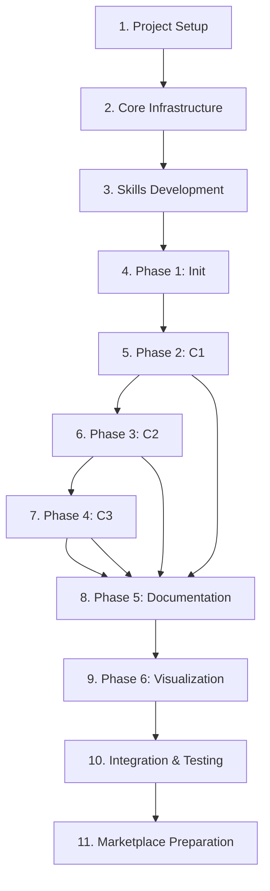

# Melly Development Tasks

> **Project**: Melly - Claude Code marketplace for C4 model-based code reverse engineering
> **Version**: 1.0.0
> **Last Updated**: 2025-11-15

## Overview

Melly is a Claude Code marketplace consisting of components that form a workflow for reverse engineering code repositories using the C4 model methodology. The workflow progressively abstracts codebases from C1 (Systems) through C4 (Code) levels, storing knowledge in a structured format accessible via basic-memory MCP.

---

## Table of Contents

1. [Project Setup](#1-project-setup)
2. [Core Infrastructure](#2-core-infrastructure)
3. [Skills Development](#3-skills-development)
4. [Phase 1: Initialization](#4-phase-1-initialization-melly-init)
5. [Phase 2: C1 Systems](#5-phase-2-c1-systems-melly-c1-systems)
6. [Phase 3: C2 Containers](#6-phase-3-c2-containers-melly-c2-containers)
7. [Phase 4: C3 Components](#7-phase-4-c3-components-melly-c3-components)
8. [Phase 5: Documentation](#8-phase-5-documentation-melly-doc-c4model)
9. [Phase 6: Visualization](#9-phase-6-visualization)
10. [Integration & Testing](#10-integration--testing)
11. [Marketplace Preparation](#11-marketplace-preparation)

---

## 1. Project Setup

### 1.1 Repository Structure

- [ ] Create `.claude/` directory structure:
  ```
  .claude/
  ├── agents/          # Sub-agents
  ├── commands/        # Slash commands
  ├── skills/          # Skills
  ├── scripts/         # Validation and helper scripts
  ├── templates/       # JSON templates
  └── settings.json    # Project settings
  ```

- [ ] Create `knowledge-base/` directory structure:
  ```
  knowledge-base/
  ├── libraries/       # Tool and package documentation
  ├── systems/         # Will be created by workflow
  └── templates/       # Markdown templates
  ```

- [ ] Create `.gitignore` entries:
  ```
  .claude/settings.local.json
  .claude/.cache/
  knowledge-base/systems/*/  # Generated content
  ```

### 1.2 Dependencies

- [ ] Add basic-memory MCP to marketplace configuration
- [ ] Add context7 MCP to marketplace configuration
- [ ] Document MCP server requirements in README
- [ ] Create `requirements.txt` or `package.json` for validation scripts

### 1.3 Documentation

- [ ] Update README.md with Melly workflow overview
- [ ] Create `docs/c4model-methodology.md` explaining C4 approach
- [ ] Create `docs/workflow-guide.md` with usage examples
- [ ] Update CLAUDE.md with Melly-specific instructions

---

## 2. Core Infrastructure

### 2.1 JSON Schemas

- [ ] Create `init.json` schema definition
  - Code repository paths
  - Package manifests (npm, composer, etc.)
  - Directory structure
  - Metadata for abstractors

- [ ] Create `c1-systems.json` schema definition
  - Systems identified
  - Observations section
  - Relations section
  - Repository mappings

- [ ] Create `c2-containers.json` schema definition
  - Containers per system
  - Observations section
  - Relations section
  - Technology stack

- [ ] Create `c3-components.json` schema definition
  - Components per container
  - Observations section
  - Relations section
  - Code structure

### 2.2 Validation Scripts

- [ ] Create `.claude/scripts/validate-init.py`
  - Validate init.json structure
  - Check path existence
  - Verify package manifests
  - Exit with appropriate codes

- [ ] Create `.claude/scripts/validate-c1-systems.py`
  - Validate c1-systems.json structure
  - Check observations format
  - Verify relations format
  - Compare with init.json

- [ ] Create `.claude/scripts/validate-c2-containers.py`
  - Validate c2-containers.json structure
  - Check timestamp ordering
  - Verify parent relationships

- [ ] Create `.claude/scripts/validate-c3-components.py`
  - Validate c3-components.json structure
  - Check timestamp ordering
  - Verify parent relationships

- [ ] Create `.claude/scripts/validate-markdown.py`
  - Validate frontmatter YAML
  - Check markdown structure
  - Verify observations/relations sections

- [ ] Create `.claude/scripts/create-folders.sh`
  - Create system folders
  - Create c1/c2/c3/c4 subdirectories
  - Set appropriate permissions

- [ ] Create `.claude/scripts/check-timestamp.sh`
  - Compare JSON file timestamps
  - Determine if reprocessing needed

---

## 3. Skills Development

### 3.1 C4 Model Skills

- [ ] Create `.claude/skills/c4model-c1/SKILL.md`
  - C1 (System Context) methodology
  - System identification rules
  - Examples from common architectures
  - Integration with basic-memory

- [ ] Create `.claude/skills/c4model-c2/SKILL.md`
  - C2 (Container) methodology
  - Container identification rules
  - Technology detection patterns
  - Integration with basic-memory

- [ ] Create `.claude/skills/c4model-c3/SKILL.md`
  - C3 (Component) methodology
  - Component identification rules
  - Code structure analysis
  - Integration with basic-memory

- [ ] Create `.claude/skills/c4model-c4/SKILL.md`
  - C4 (Code) methodology
  - Code-level analysis
  - Class/function mapping
  - Integration with basic-memory

### 3.2 Documentation Skills

- [ ] Create `.claude/skills/c4model-observations/SKILL.md`
  - Observation section format
  - Key findings documentation
  - Pattern recognition
  - Template structure

- [ ] Create `.claude/skills/c4model-relations/SKILL.md`
  - Relations section format
  - Dependency mapping
  - Relationship types
  - Template structure

### 3.3 Template Files

- [ ] Create `.claude/templates/c1-systems-template.json`
  - Markdown structure for C1 docs
  - Frontmatter requirements
  - Section templates
  - Observations/relations format

- [ ] Create `.claude/templates/c2-containers-template.json`
  - Markdown structure for C2 docs
  - Frontmatter requirements
  - Section templates
  - Observations/relations format

- [ ] Create `.claude/templates/c3-components-template.json`
  - Markdown structure for C3 docs
  - Frontmatter requirements
  - Section templates
  - Observations/relations format

---

## 4. Phase 1: Initialization (`/melly-init`)

### 4.1 Slash Command

- [ ] Create `.claude/commands/melly-init.md`
  - Description: Initialize C4 model exploration
  - Argument hint: [repository-path]
  - Allowed tools: Task, Read, Write, Bash
  - Command logic:
    - Invoke c4model-explorer agent
    - Validate init.json output
    - Commit init.json to repository

### 4.2 Sub-agent: c4model-explorer

- [ ] Create `.claude/agents/c4model-explorer.md`
  - Name: c4model-explorer
  - Description: Explore code repositories and create init.json
  - Tools: Read, Glob, Grep, Bash, Write
  - Workflow:
    1. Prompt user for repository location
    2. Scan all repositories in location
    3. Analyze structure and key files
    4. Identify package manifests (package.json, composer.json, etc.)
    5. Map directory structure
    6. Generate init.json
    7. Validate with `.claude/scripts/validate-init.py`
    8. Return results

- [ ] Add reusability to c4model-explorer:
  - Accept incremental updates
  - Validate changed repositories only
  - Merge with existing init.json

---

## 5. Phase 2: C1 Systems (`/melly-c1-systems`)

### 5.1 Slash Command

- [ ] Create `.claude/commands/melly-c1-systems.md`
  - Description: Identify C1-level systems
  - Allowed tools: Task, Read, Write, Bash
  - Command logic:
    1. Run c4model-explorer for validation
    2. Invoke c1-abstractor per repository
    3. Validate c1-systems.json
    4. Commit results

### 5.2 Sub-agent: c1-abstractor

- [ ] Create `.claude/agents/c1-abstractor.md`
  - Name: c1-abstractor
  - Description: Identify C1 systems from repositories
  - Tools: Read, Grep, Bash, Write, Skill(c4model-c1)
  - Workflow:
    1. Validate init.json exists
    2. Load c4model-c1 skill
    3. Scan repository paths from init.json
    4. Identify systems per C4 C1 methodology
    5. Execute `.claude/scripts/create-folders.sh` for each system
    6. Validate folders created
    7. Generate c1-systems.json with observations and relations
    8. Validate with `.claude/scripts/validate-c1-systems.py`
    9. Return results

- [ ] Add incremental processing:
  - Detect changes in init.json
  - Process only modified repositories
  - Merge with existing c1-systems.json

- [ ] Implement parallel execution:
  - Run c1-abstractor per repository concurrently
  - Aggregate results into single c1-systems.json

---

## 6. Phase 3: C2 Containers (`/melly-c2-containers`)

### 6.1 Slash Command

- [ ] Create `.claude/commands/melly-c2-containers.md`
  - Description: Identify C2-level containers
  - Allowed tools: Task, Read, Write, Bash
  - Command logic:
    1. Run c4model-explorer for validation
    2. Check if c1-systems.json is up to date
    3. Exit if /melly-c1-systems needed
    4. Invoke c2-abstractor per repository
    5. Validate c2-containers.json
    6. Commit results

### 6.2 Sub-agent: c2-abstractor

- [ ] Create `.claude/agents/c2-abstractor.md`
  - Name: c2-abstractor
  - Description: Identify C2 containers from systems
  - Tools: Read, Grep, Bash, Write, Skill(c4model-c2)
  - Workflow:
    1. Validate init.json and c1-systems.json exist
    2. Check timestamps with `.claude/scripts/check-timestamp.sh`
    3. Load c4model-c2 skill
    4. Scan repository paths
    5. Identify containers per C4 C2 methodology
    6. Generate c2-containers.json with observations and relations
    7. Validate with `.claude/scripts/validate-c2-containers.py`
    8. Return results

- [ ] Add incremental processing:
  - Detect changes in c1-systems.json
  - Process only modified systems
  - Merge with existing c2-containers.json

- [ ] Implement parallel execution:
  - Run c2-abstractor per repository concurrently
  - Aggregate results into single c2-containers.json

---

## 7. Phase 4: C3 Components (`/melly-c3-components`)

### 7.1 Slash Command

- [ ] Create `.claude/commands/melly-c3-components.md`
  - Description: Identify C3-level components
  - Allowed tools: Task, Read, Write, Bash
  - Command logic:
    1. Run c4model-explorer for validation
    2. Check if c2-containers.json is up to date
    3. Exit if /melly-c2-containers needed
    4. Invoke c3-abstractor per repository
    5. Validate c3-components.json
    6. Commit results

### 7.2 Sub-agent: c3-abstractor

- [ ] Create `.claude/agents/c3-abstractor.md`
  - Name: c3-abstractor
  - Description: Identify C3 components from containers
  - Tools: Read, Grep, Bash, Write, Skill(c4model-c3)
  - Workflow:
    1. Validate init.json, c1-systems.json, c2-containers.json exist
    2. Check timestamps with `.claude/scripts/check-timestamp.sh`
    3. Load c4model-c3 skill
    4. Scan repository paths
    5. Identify components per C4 C3 methodology
    6. Generate c3-components.json with observations and relations
    7. Validate with `.claude/scripts/validate-c3-components.py`
    8. Return results

- [ ] Add incremental processing:
  - Detect changes in c2-containers.json
  - Process only modified containers
  - Merge with existing c3-components.json

- [ ] Implement parallel execution:
  - Run c3-abstractor per repository concurrently
  - Aggregate results into single c3-components.json

---

## 8. Phase 5: Documentation (`/melly-doc-c4model`)

### 8.1 Slash Command

- [ ] Create `.claude/commands/melly-doc-c4model.md`
  - Description: Generate C4 model documentation
  - Allowed tools: Task, Read, Write, Bash
  - Command logic:
    1. Validate all JSON files exist
    2. Invoke c4model-writer agents in parallel for each level
    3. Validate markdown output
    4. Commit documentation

### 8.2 Sub-agent: c4model-writer

- [ ] Create `.claude/agents/c4model-writer.md`
  - Name: c4model-writer
  - Description: Generate markdown documentation from JSON
  - Tools: Read, Write, Bash, MCP(basic-memory)
  - Workflow:
    1. Accept level parameter (c1, c2, c3)
    2. Detect changes in corresponding JSON file
    3. Load appropriate template (c1-systems-template.json, etc.)
    4. For each system/container/component:
       - Check if new or updated
       - Generate markdown from template
       - Populate observations section
       - Populate relations section
       - Use basic-memory MCP for all operations
    5. Validate markdown with `.claude/scripts/validate-markdown.py`
    6. Return results

- [ ] Implement parallel processing:
  - Run c4model-writer for c1, c2, c3 simultaneously
  - Each operates on independent data

- [ ] Add basic-memory integration:
  - All file operations through basic-memory MCP
  - Leverage MCP's knowledge base features
  - Support syncing

---

## 9. Phase 6: Visualization

### 9.1 Sub-agent: c4model-drawer

- [ ] Create `.claude/agents/c4model-drawer.md`
  - Name: c4model-drawer
  - Description: Generate Obsidian canvas diagrams with Mermaid
  - Tools: Read, Write, MCP(basic-memory)
  - Workflow:
    1. Read c1-systems.json, c2-containers.json, c3-components.json
    2. Parse observations and relations
    3. Generate Mermaid diagrams for:
       - System context (C1)
       - Container diagrams (C2)
       - Component diagrams (C3)
    4. Create Obsidian canvas files
    5. Use basic-memory canvas tool
    6. Return results

### 9.2 Slash Command

- [ ] Create `.claude/commands/melly-draw-c4model.md`
  - Description: Generate visual diagrams from C4 model
  - Argument hint: [level]  # c1, c2, c3, or all
  - Allowed tools: Task, MCP(basic-memory)
  - Command logic:
    - Invoke c4model-drawer
    - Specify level (c1/c2/c3/all)
    - Validate canvas output

---

## 10. Integration & Testing

### 10.1 End-to-End Testing

- [ ] Create test repository structure in `test/fixtures/`
- [ ] Create test case: Simple single-repo project
- [ ] Create test case: Multi-repo microservices
- [ ] Create test case: Monorepo structure
- [ ] Create test case: Mixed technology stack

### 10.2 Workflow Testing

- [ ] Test `/melly-init` on each test case
- [ ] Test `/melly-c1-systems` on each test case
- [ ] Test `/melly-c2-containers` on each test case
- [ ] Test `/melly-c3-components` on each test case
- [ ] Test `/melly-doc-c4model` on each test case
- [ ] Test `/melly-draw-c4model` on each test case

### 10.3 Incremental Update Testing

- [ ] Modify test repository and re-run `/melly-init`
- [ ] Verify only changed repos processed
- [ ] Add new repository and verify detection
- [ ] Remove repository and verify handling

### 10.4 Error Handling

- [ ] Test invalid repository paths
- [ ] Test missing JSON files
- [ ] Test corrupted JSON files
- [ ] Test timestamp order violations
- [ ] Test markdown validation failures

---

## 11. Marketplace Preparation

### 11.1 Plugin Configuration

- [ ] Update `.claude-plugin/marketplace.json`:
  - Add Melly workflow metadata
  - List all slash commands
  - List all sub-agents
  - List all skills
  - Specify dependencies (basic-memory, context7)

### 11.2 Documentation

- [ ] Create `docs/installation.md`
  - MCP server setup
  - Repository configuration
  - First-time usage guide

- [ ] Create `docs/workflow-reference.md`
  - Complete command reference
  - Sub-agent descriptions
  - Skill descriptions
  - JSON schema reference

- [ ] Create `docs/examples.md`
  - Real-world examples
  - Common patterns
  - Troubleshooting

- [ ] Create `docs/contributing.md`
  - How to extend Melly
  - Custom skill development
  - Template modifications

### 11.3 Quality Assurance

- [ ] Verify all slash commands work
- [ ] Verify all sub-agents work
- [ ] Verify all skills activate correctly
- [ ] Verify all validation scripts work
- [ ] Test on different operating systems (Linux, macOS, Windows)

### 11.4 Repository Cleanup

- [ ] Remove test artifacts
- [ ] Update all documentation
- [ ] Verify .gitignore is complete
- [ ] Create release notes
- [ ] Tag version 1.0.0

---

## Appendix: Task Dependencies



---

## Priority Legend

- **P0 (Critical)**: Core functionality, blocking other tasks
- **P1 (High)**: Important features, minimal blockers
- **P2 (Medium)**: Nice-to-have features
- **P3 (Low)**: Future enhancements

### Priority Assignments

#### P0 Tasks
1. Project Setup (Section 1)
2. JSON Schemas (Section 2.1)
3. Validation Scripts (Section 2.2)
4. C4 Model Skills - C1, C2, C3 (Section 3.1)
5. Phase 1: Initialization (Section 4)
6. Phase 2: C1 Systems (Section 5)

#### P1 Tasks
7. Phase 3: C2 Containers (Section 6)
8. Phase 4: C3 Components (Section 7)
9. Documentation Skills (Section 3.2)
10. Template Files (Section 3.3)
11. Phase 5: Documentation (Section 8)

#### P2 Tasks
12. Phase 6: Visualization (Section 9)
13. Integration & Testing (Section 10)
14. Marketplace Preparation (Section 11)

#### P3 Tasks
15. C4 Level 4 (Code) implementation
16. Advanced visualizations
17. AI-powered refactoring suggestions

---

## Notes

- All scripts should be executable: `chmod +x .claude/scripts/*`
- All JSON files should be validated before commit
- Use basic-memory MCP for all knowledge base operations
- Test incrementally after each phase
- Keep documentation synchronized with implementation
- Follow CLAUDE.md guidelines for all component development

---

**Total Tasks**: 100+
**Estimated Timeline**: 4-6 weeks for complete implementation
**Last Updated**: 2025-11-15
